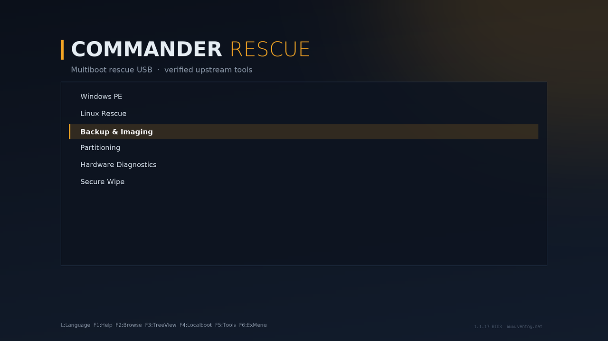

<div align="center">

# Commander Rescue

**A lean, always-current multiboot rescue USB, in the spirit of MediCat.**

[](https://github.com/Commanderx-code/commander-rescue/actions/workflows/ci.yml)

One stick with a Windows 11 PE desktop and the best free Linux rescue tools,
rebuilt from upstream sources and verified before it touches your drive.

</div>

---

MediCat was the stick everyone carried, but its last full build is from
December 2021. It has 15 overlapping tools, most of them commercial trialware,
all frozen at 2021 versions. Commander Rescue keeps the idea and drops the rest:

- **One tool per job.** Only free tools, with no trial nags.
- **Always current.** Every tool resolves to its latest upstream release.
- **Verified.** Downloads are checked against the publisher's own checksums.
  Anything without one is flagged loudly instead of trusted silently.
- **Refreshable in place.** `./refresh.sh` swaps new versions onto the stick
  and leaves the ISOs you added yourself alone.
- **No redistribution headaches.** The repo holds a manifest and scripts, not
  binaries. The Windows PE is built from *your* Windows ISO.

## What's on the stick



| Menu | Tool | Source |
|---|---|---|
| Windows PE | **Commander PE**, your own [PhoenixPE](https://github.com/PhoenixPE/PhoenixPE) Win11 build | built locally ([guide](pe/README.md)) |
| | Hiren's BootCD PE, ready-made Win11 PE | hirensbootcd.org · unverified |
| Rescue Environments | SystemRescue | SourceForge · sha512 |
| Backup & Recovery | Rescuezilla, Clonezilla | GitHub · sha256 / SourceForge · sha512 |
| Partitioning | GParted Live | SourceForge · sha512 |
| Hardware Diagnostics | Memtest86+ | memtest.org · sha512 |
| Secure Wipe | ShredOS (nwipe) | GitHub · sha256 |
| Boot Repair | Super GRUB2 Disk | SourceForge · sha256 |
| | Boot-Repair-Disk | SourceForge · md5 |
| Malware Scan | Dr.Web LiveDisk, Kaspersky Rescue Disk *(off by default)* | vendor sites · unverified |
| **PE apps** (`USB:\Apps`) | Sysinternals, Explorer++, Notepad++, CrystalDiskInfo, CrystalDiskMark, HWiNFO, TestDisk/PhotoRec, ProduKey, DiskGenius Free | various |
| | Microsoft Safety Scanner, Kaspersky Virus Removal Tool *(off by default)* (malware scans inside the PE) | vendor sites · unverified |

*Unverified* means the publisher offers no checksum. The file is trusted on
first download and refused if it later changes without a new version (see
below). Antivirus tools carry their virus definitions, so `./refresh.sh`
before a job keeps them current. Microsoft Safety Scanner stops working 10
days after download. Kaspersky refuses downloads from the US, so its two
tools are off; outside the US, turn them on in `local.toml`:

```toml
[overrides.kaspersky-rd]
enabled = true

[overrides.kvrt]
enabled = true
```

**Bring your own.** Paid and licence-restricted tools get menu slots you fill
with your own copy: Macrium Reflect, AOMEI Backupper and Partition Assistant,
EaseUS Todo Backup and Data Recovery, Paragon Hard Disk Manager, Parted Magic,
Active@ Data Studio, BootIt Bare Metal, SpinRite, PassMark MemTest86, HDAT2, Windows
10/11 Setup (WinRE), Microsoft DaRT and Jayro's Lockpick. Drop the ISO into
[`byo/`](byo/README.md) under its slot name and `./refresh.sh` puts it in the
right menu. Nothing is downloaded or shared for these.

Everything lives in [`tools.toml`](tools.toml). Adding a tool is a few lines.

## Quick start

Requirements: Linux, Python 3.11+, `sudo`, and `udisksctl` (optional). There's
nothing to `pip install`.

```fish
git clone https://github.com/Commanderx-code/commander-rescue
cd commander-rescue

./crescue check        # what's the latest of everything? (no downloads)
./install.sh           # download + verify, pick a stick, type its name, done
```

Later:

```fish
./refresh.sh                    # update the stick in place
./refresh.sh --upgrade-ventoy   # …and the Ventoy boot loader too
```

### On Windows

Download **`CommanderRescue.exe`** from
[Releases](https://github.com/Commanderx-code/commander-rescue/releases) (or the
latest [build](https://github.com/Commanderx-code/commander-rescue/actions/workflows/windows.yml)),
put it in a folder of its own and run it. It asks for admin rights because
installing Ventoy writes to the disk.

1. Pick the USB stick. Only USB/SD disks are listed, never the one Windows is
   running from.
2. **Install** erases the stick (you type its disk number to confirm), installs
   Ventoy and copies everything on. **Update** refreshes a stick you already
   have and keeps your files.

It's the same engine as the Linux scripts, with the same tool list,
checksums, theme and menu. Your `local.toml` and `byo/` folder live next to
the `.exe`, and downloads are cached in `%LOCALAPPDATA%\CommanderRescue`. The
command line works too: `CommanderRescue.exe --help`.

## `crescue`, the engine

`install.sh` and `refresh.sh` are thin wrappers. The work happens in `crescue`,
a single standard-library Python script:

| Command | Does |
|---|---|
| `crescue list` | every tool, its source, and whether it's enabled |
| `crescue check [--json]` | compares your cache against upstream, no downloads |
| `crescue fetch [tool…] [--force]` | downloads, verifies, caches (`~/.cache/commander-rescue`), resumes interrupted downloads |
| `crescue sync <mount> [--dry-run] [--verify]` | copies the cache to a Ventoy stick, prunes old versions, writes `ventoy.json` |

### How verification works

Each tool lists checksum strategies in order of preference. The first one
that yields a hash is used, and a mismatch deletes the file and stops:

1. the publisher's checksum file (`sha256.txt`, `CHECKSUMS.TXT`, `*.sha512`)
2. GitHub's recorded sha256 digest for the release asset
3. SourceForge's md5 (integrity only)
4. `tofu`: trust-on-first-use, **only if the manifest explicitly says so**.
   The hash is recorded, and a re-download of the same version with a
   different hash is refused as possible tampering.

If no strategy works, the tool is refused rather than silently used.

## Customising

Personal changes go in `local.toml` (git-ignored). It overlays `tools.toml`:

```toml
[overrides.hirens]
enabled = false             # don't want Hiren's on this stick

[overrides.shredos]
enabled = false             # don't want a wipe tool on this stick

[[tool]]                    # add your own
name = "kali"
title = "Kali Linux"
kind = "iso"
category = "rescue"
source = "url"
url = "https://cdimage.kali.org/current/kali-linux-2026.3-live-amd64.iso"
version_pin = "2026.3"
checksum = [{ url = "https://cdimage.kali.org/current/SHA256SUMS" }]
```

ISOs you drop onto the stick by hand (e.g. in `ISO/Custom/`) are never touched.

The boot-menu theme lives in [`theme/`](theme/). Edit `theme.txt` for layout,
or the colours and text in `theme/build-theme.py` and re-run it to regenerate
the images and fonts. For Ventoy's stock look, put `theme = ""` under
`[settings]` in `local.toml`.

## Layout on the stick

```
ISO/1-Windows-PE/   ISO/2-Rescue/   ISO/3-Imaging/   ISO/4-Partitioning/
ISO/5-Diagnostics/  ISO/6-Data-Wipe/
Apps/               portable apps + CommanderApps.cmd launcher
ventoy/ventoy.json  generated menu: tree view, friendly names, tips
.commander-rescue/  sync state (which files this project manages)
```

## Safety

- `install.sh` downloads and verifies **before** touching any disk.
- It lists only USB/removable disks and refuses any disk holding your running
  system (it follows LUKS, LVM and btrfs subvolumes back to the physical disk).
- You must type the device name to confirm, and it warns if the "stick" is
  suspiciously large.
- `refresh.sh` never erases anything except old versions of files it put there.

## Status

- [x] Manifest, fetch/verify engine, installer, refresher, Ventoy menu
- [x] PE app launcher (works in any WinPE)
- [x] CI: tests, ShellCheck, weekly live resolve + download + verify of every tool
- [x] Recommended PhoenixPE preset + Commander Rescue add-on ([guide](pe/README.md))
- [ ] First Commander PE build
- [x] Ventoy theme
- [x] Windows app (`CommanderRescue.exe`)
- [ ] Commander Toolbox entry

## Credits

[Ventoy](https://www.ventoy.net) · [PhoenixPE](https://github.com/PhoenixPE/PhoenixPE) ·
every tool author listed in `tools.toml` · inspired by MediCat USB.
Each tool keeps its own license; this repo's scripts are MIT.
