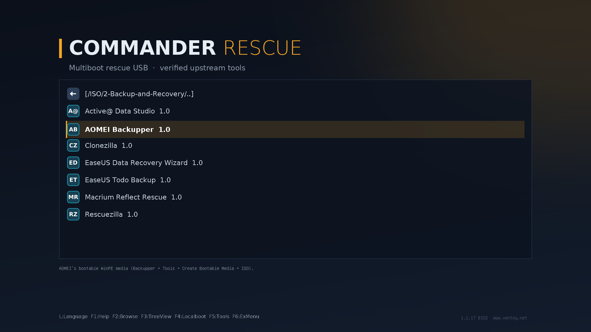

<div align="center">

# Commander Rescue

**A multiboot rescue USB that builds itself from upstream sources.**<br>
Current tools, verified downloads, a MediCat-style boot menu, and room for your own licensed software.

[](https://github.com/Commanderx-code/commander-rescue/actions/workflows/ci.yml)
[](https://github.com/Commanderx-code/commander-rescue/actions/workflows/windows.yml)
[](https://github.com/Commanderx-code/commander-rescue/releases)
[](LICENSE)


[Quick start](#quick-start) ·
[What's on the stick](#whats-on-the-stick) ·
[Packs](#packs-the-whole-stick-in-one-file) ·
[Lazarus PE](pe/README.md) ·
[Customising](#customising) ·
[Changelog](CHANGELOG.md)


</div>

## Why

MediCat was the stick everyone carried, but its last full build dates from
December 2021: frozen versions, overlapping tools and plenty of trialware.
Commander Rescue keeps the idea (one stick, a categorised menu, a Windows PE
desktop) and fixes the rest:

| | |
|---|---|
| **Always current** | Every tool resolves to its latest upstream release on each refresh. |
| **Verified** | Downloads are checked against the publisher's own checksums before they reach the stick. Anything without one is flagged, never trusted silently. |
| **Free by default** | The shipped tool list is free software and freeware. Paid tools get [bring-your-own](#bring-your-own-tools) slots for your licensed copies. |
| **Refreshable in place** | `./refresh.sh` swaps in new versions and leaves files you added yourself alone. |
| **Offline-ready** | [Packs](#packs-the-whole-stick-in-one-file) put the whole stick, your own tools included, into one zip that builds a stick with no internet. |
| **Nothing redistributed** | The repo holds a manifest and scripts, not binaries. The Windows PE is built from *your* Windows ISO. |

## Quick start

**Linux.** Needs Python 3.11+ and `sudo`; nothing to `pip install`.

```fish
git clone https://github.com/Commanderx-code/commander-rescue
cd commander-rescue

./crescue check        # latest version of everything (no downloads)
./install.sh           # download + verify, pick a stick, type its name to confirm
```

Keep it current later:

```fish
./refresh.sh                    # update the stick in place
./refresh.sh --upgrade-ventoy   # …and the Ventoy boot loader too
```

**Windows.** Download **`CommanderRescue.exe`** from
[Releases](https://github.com/Commanderx-code/commander-rescue/releases), put it
in a folder of its own and run it (see [below](#windows-app)).

**From a pack.** Already have a pack zip? No clone needed:
`unzip pack.zip 'installer/*'`, then `installer/install.sh`
([details](#packs-the-whole-stick-in-one-file)).

## What's on the stick

Nine categories, each with its own icon, and every tool inside with an icon
and a one-line tip. Tools that only start on older BIOS PCs (DBAN, HDAT2,
SpinRite) are marked **[BIOS]**, and UEFI-only ones **[UEFI]**, detected from
each ISO's boot records. Windows `.wim` boot images (WinRE, WinPE tools) work
too: Ventoy's wimboot plugin comes with the stick.



| Menu | Tools | Source · verification |
|---|---|---|
| Antivirus | Dr.Web LiveDisk | vendor site · unverified |
| | Kaspersky Rescue Disk *(off by default, see below)* | vendor site · unverified |
| Backup and Recovery | Rescuezilla | GitHub · sha256 |
| | Clonezilla | SourceForge · sha512 |
| Boot Repair | Super GRUB2 Disk | SourceForge · sha256 |
| | Boot-Repair-Disk | SourceForge · md5 |
| Diagnostic Tools | Memtest86+ | memtest.org · sha512 |
| Disk Wipe | ShredOS (nwipe) | GitHub · sha256 |
| | DBAN (BIOS boot only) | SourceForge · md5 |
| Live Operating Systems | **Lazarus PE**, your own [PhoenixPE](https://github.com/PhoenixPE/PhoenixPE) Windows 11 build | built locally · [guide](pe/README.md) |
| | Hiren's BootCD PE | hirensbootcd.org · unverified |
| | SystemRescue | SourceForge · sha512 |
| Partition Tools | GParted Live | SourceForge · sha512 |
| Password Removal | *bring your own* (e.g. Jayro's Lockpick) | [`byo/`](byo/README.md) |
| Windows Recovery | *bring your own* (Windows 10/11 setup, DaRT) | [`byo/`](byo/README.md) |

**Portable apps** for any Windows PE, in `USB:\Apps` with a menu launcher:
Sysinternals, Explorer++, Notepad++, CrystalDiskInfo, CrystalDiskMark, HWiNFO,
TestDisk & PhotoRec, ProduKey, DiskGenius Free, Microsoft Safety Scanner and
Kaspersky Virus Removal Tool *(off by default)*. The launcher also carries
[Chris Titus Tech's WinUtil](https://github.com/ChrisTitusTech/winutil) for
after a repair: run it from the stick in the fixed Windows to debloat, tweak
or reinstall apps.

<details>
<summary><b>Notes on unverified tools, antivirus and Kaspersky</b></summary>

*Unverified* means the publisher offers no checksum. The file is trusted on
first download and refused if it later changes without a new version (see
[verification](#verification)). Antivirus tools carry their virus
definitions, so `./refresh.sh` before a job keeps them current. Microsoft
Safety Scanner stops working 10 days after download.

On newer PCs, Kaspersky Rescue Disk's *Graphic mode* can end on a black
screen (its 2018 kernel predates their graphics): choose *Limited graphic
mode* in its menu instead.

Kaspersky refuses downloads from the US, so its two tools are off. Outside the
US, turn them on in `local.toml`:

```toml
[overrides.kaspersky-rd]
enabled = true

[overrides.kvrt]
enabled = true
```

</details>

> [!TIP]
> DBAN and ShredOS overwrite **hard drives**. For SSDs and NVMe drives use
> Parted Magic's *Erase Disk*, which runs the drive's own secure erase or
> sanitize command and reaches the spare flash an overwrite can miss. The
> boot menu says so too.

Every tool is described in [`tools.toml`](tools.toml); adding one is a few lines.

### PortableApps.com

The [PortableApps.com Platform](https://portableapps.com) sits at the root of
the stick (`Start.exe`), like on MediCat: run it on any Windows PC, and
Lazarus PE opens it by itself when the desktop loads. Pick apps from its App
Store; it keeps them and itself up to date. Commander Rescue puts the Platform
on once and never overwrites or prunes it, so your apps survive every refresh.
The Commander Apps menu also has **p) PortableApps.com menu**.

It comes with five **Helix** menu themes (Purple, Electric, Teal, Orange, Red)
and opens in Helix Teal on a new stick. The Platform's picker lists only its
own themes, so they take over the last five entries in **Options > Themes**:
Modern Dark, Retro Light, Retro Dark, Smooth Light and Smooth Dark. Make your
own from any artwork with the menu's panels drawn in:

```fish
portableapps/make-theme.py ~/art/teal.png "Helix Teal" --slot RetroDark --accent 1ec8e6
```

It finds the panels, fits the art to the Platform's fixed 406x558 menu, and
writes the theme to `portableapps/themes/<slot>/` (`--hue` recolours the art).

### Bring your own tools

Paid and licence-restricted tools get menu slots you fill with your own copy:
Macrium Reflect, AOMEI Backupper and Partition Assistant, EaseUS Todo Backup
and Data Recovery, Paragon Hard Disk Manager, Parted Magic, Active@ Data
Studio, BootIt Bare Metal, SpinRite, PassMark MemTest86, HDAT2, Windows 10/11
Setup, Microsoft DaRT and Jayro's Lockpick. Drop the ISO into
[`byo/`](byo/README.md) under its slot name and `./refresh.sh` puts it in the
right menu. Anything else (another ISO, a `.wim`, a portable app) gets a slot
of its own in `local.toml`. Nothing in `byo/` is ever downloaded, shared or
committed.

## Packs: the whole stick in one file

Like MediCat's download, a pack is one file with every tool in it, ready to
extract onto a stick. It's made from your cache, so it includes your
bring-your-own tools and the Ventoy installer, and a new stick needs no internet:

```fish
./crescue fetch                                 # bring everything up to date
./crescue pack                                  # → commander-rescue-<date>.zip
./install.sh --from commander-rescue-<date>.zip # new stick
./refresh.sh --from commander-rescue-<date>.zip # update a stick
```

The pack carries its own installer, so on another Linux PC the zip is all you need:

```fish
unzip commander-rescue-<date>.zip 'installer/*'   # a few MB
installer/install.sh                               # finds the zip beside it
```

Inside is the stick exactly as `crescue sync` lays it out, with boot images
stored uncompressed and each one's sha256 recorded. Extracting streams files
straight onto the stick and checks every image, so a damaged pack is caught,
not booted. A stick filled from a pack refreshes normally afterwards.

> [!IMPORTANT]
> A pack holds your licensed tools, so keep it private: a drive, a NAS or your
> own cloud storage, never a public repo or release. Packs made in this folder
> are git-ignored.

## Windows app

`CommanderRescue.exe` asks for admin rights, because installing Ventoy writes
to the disk.

1. Pick the USB stick. Only USB/SD disks are listed, never the one Windows is
   running from.
2. **Install** erases the stick (you type its disk number to confirm), installs
   Ventoy and copies everything on. **Update** refreshes a stick you already
   have and keeps your files.

It uses the same engine as the Linux scripts: the same tool list, checksums,
theme and menu. Your `local.toml` and `byo/` folder live next to the `.exe`, and
downloads are cached in `%LOCALAPPDATA%\CommanderRescue`. The command line
works too: `CommanderRescue.exe --help`. Packs are Linux-only for now.

## Lazarus PE

Lazarus PE is the stick's Windows 11 desktop, filling the role of MediCat's
Mini Windows. You build it yourself with PhoenixPE from your own Windows ISO,
because WinPE images contain Microsoft files that can't be redistributed. The
image stays lean: drivers, networking and Explorer. The portable apps live on
the stick and update without a rebuild. On Linux, `pe/vm/build-vm.sh` sets up
the build VM for you. See the [Lazarus PE guide](pe/README.md).

Until yours is built, Hiren's BootCD PE covers for it, and the app launcher
works there too.

## `crescue`, the engine

`install.sh` and `refresh.sh` are thin wrappers around `crescue`, a single
standard-library Python script:

| Command | Does |
|---|---|
| `crescue list` | every tool, its source, and whether it's enabled |
| `crescue check [--json]` | compares your cache against upstream, no downloads |
| `crescue fetch [tool…] [--force]` | downloads, verifies and caches (`~/.cache/commander-rescue`); resumes interrupted downloads |
| `crescue sync <mount> [--dry-run] [--verify]` | copies the cache to a Ventoy stick, prunes old versions, writes the menu |
| `crescue pack [file.zip]` | the whole stick, your own tools and Ventoy in one zip |
| `crescue unpack <pack.zip> <mount> [--dry-run] [--verify]` | fills a Ventoy stick from a pack, no downloads |

### Verification

Each tool lists checksum strategies in order of preference. The first one
that yields a hash is used; a mismatch deletes the file and stops:

1. the publisher's checksum file (`sha256.txt`, `CHECKSUMS.TXT`, `*.sha512`)
2. GitHub's recorded sha256 digest for the release asset
3. SourceForge's md5 (integrity only)
4. `tofu`: trust-on-first-use, **only if the manifest explicitly says so**.
   The hash is recorded, and a re-download of the same version with a
   different hash is refused as possible tampering.

If no strategy works, the tool is refused rather than silently used.

### Safety

- `install.sh` downloads and verifies everything **before** touching any disk.
- It lists only USB/removable disks and refuses any disk holding your running
  system, following LUKS, LVM and btrfs back to the physical disk.
- You type the device name to confirm, and it warns if the "stick" is
  suspiciously large.
- `refresh.sh` never erases anything except old versions of files it put there.

## Customising

Personal changes go in `local.toml` (git-ignored), which overlays `tools.toml`:

```toml
[overrides.hirens]
enabled = false             # leave Hiren's off this stick

[[tool]]                    # add your own
name = "kali"
title = "Kali Linux"
kind = "iso"
category = "live"
source = "url"
url = "https://cdimage.kali.org/current/kali-linux-2026.3-live-amd64.iso"
version_pin = "2026.3"
checksum = [{ url = "https://cdimage.kali.org/current/SHA256SUMS" }]
```

ISOs you copy onto the stick by hand (e.g. into `ISO/Custom/`) are never touched.

**Theme.** The boot-menu theme lives in [`theme/`](theme/). Edit `theme.txt`
for layout, or the colours and text in `theme/build-theme.py` and re-run it to
regenerate the images, icons and fonts. To show a tool's real logo instead of
its letter badge, save a square PNG (ideally 40×40) as
`byo/icons/<tool name>.png`; `byo/icons/cat-<category id>.png` replaces a
category icon. For Ventoy's stock look, set `theme = ""` under `[settings]`.

<details>
<summary><b>Layout on the stick</b></summary>

```
ISO/1-Antivirus/  ISO/2-Backup-and-Recovery/  ISO/3-Boot-Repair/
ISO/4-Diagnostic-Tools/  ISO/5-Disk-Wipe/  ISO/6-Live-Operating-Systems/
ISO/7-Partition-Tools/  ISO/8-Password-Removal/  ISO/9-Windows-Recovery/
Apps/               portable apps + CommanderApps.cmd launcher
ventoy/ventoy.json  generated menu: tree view, friendly names, icons, tips
.commander-rescue/  sync state (which files this project manages)
```

</details>

## Roadmap

- [x] Manifest, fetch/verify engine, installer, refresher, Ventoy menu and theme
- [x] PE app launcher (works in any WinPE)
- [x] CI: tests, ShellCheck, weekly live resolve + download + verify of every tool
- [x] Windows app (`CommanderRescue.exe`)
- [x] Packs: offline, self-installing zip of the whole stick
- [x] PhoenixPE preset, Commander Rescue add-on and build VM ([guide](pe/README.md))
- [x] First Lazarus PE build
- [x] PortableApps.com Platform with custom menu themes
- [ ] Packs in the Windows app
- [ ] Commander Toolbox entry

## Contributing

Bug reports, tool suggestions and pull requests are welcome. See
[CONTRIBUTING.md](CONTRIBUTING.md), and please report security issues
privately as described in [SECURITY.md](SECURITY.md).

## Credits and license

Built on [Ventoy](https://www.ventoy.net) and
[PhoenixPE](https://github.com/PhoenixPE/PhoenixPE), with thanks to every tool
author listed in [`tools.toml`](tools.toml). Inspired by MediCat USB.

This repo's scripts are [MIT](LICENSE) licensed. Each tool keeps its own
license, and nothing here grants rights to software you bring yourself.
