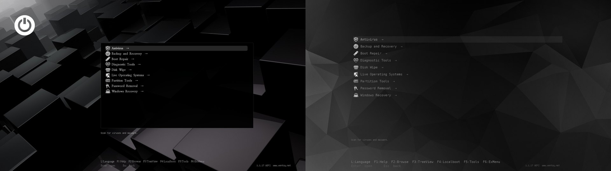
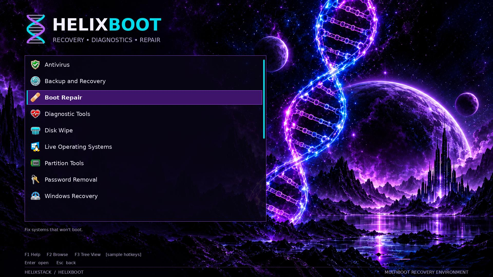

<div align="center">


# Helix Boot

**A multiboot rescue USB that builds itself from upstream sources.**<br>
Current tools, verified downloads, a MediCat-style boot menu, and room for your own licensed software.

[](https://github.com/Commanderx-code/helix-boot/actions/workflows/ci.yml)
[](https://github.com/Commanderx-code/helix-boot/actions/workflows/windows.yml)
[](https://github.com/Commanderx-code/helix-boot/releases)
[](LICENSE)


[Quick start](#quick-start) ·
[What's on the stick](#whats-on-the-stick) ·
[Packs](#packs-the-whole-stick-in-one-file) ·
[Lazarus PE](#lazarus-pe) ·
[Themes](#the-boot-menus-look) ·
[Customising](#customising) ·
[Changelog](CHANGELOG.md)


</div>

## Why

MediCat was the stick everyone carried, but its last full build dates from
December 2021: frozen versions, overlapping tools and plenty of trialware.
Helix Boot keeps the idea (one stick, a categorised menu, a Windows PE
desktop) and fixes the rest:

| | |
|---|---|
| **Always current** | Every tool resolves to its latest upstream release on each refresh. |
| **Verified** | Downloads are checked against the publisher's own checksums before they reach the stick. Anything without one is flagged, never trusted silently. |
| **Free by default** | The shipped tool list is free software and freeware. Paid tools get [bring-your-own](#bring-your-own-tools) slots for your licensed copies. |
| **Refreshable in place** | `./refresh.sh` swaps in new versions and leaves alone the files you added yourself, and the tools another PC put there. |
| **Yours to restyle** | Seven boot-menu [themes](#the-boot-menus-look), icon styles, your own background and splash: switched on a finished stick from Linux or the Windows app, with a preview first. |
| **Offline-ready** | [Packs](#packs-the-whole-stick-in-one-file) put the whole stick, your own tools included, into one zip that builds a stick with no internet, from Linux or Windows. |
| **A real recovery desktop** | [Lazarus PE](#lazarus-pe), your own Windows 11 PE, opens on a full-screen launcher with every tool on the stick sorted into categories. |
| **Nothing redistributed** | The repo holds a manifest and scripts, not binaries. The Windows PE is built from *your* Windows ISO. |

## Quick start

**Linux.** Needs Python 3.11+ and `sudo`; nothing to `pip install`.

```fish
git clone https://github.com/Commanderx-code/helix-boot
cd helix-boot

./helix check        # latest version of everything (no downloads)
./install.sh           # download + verify, pick a stick, type its name to confirm
```

Keep it current later:

```fish
./refresh.sh                    # update the stick in place
./refresh.sh --upgrade-ventoy   # …and the Ventoy boot loader too
./theme.sh --menu               # change how the boot menu looks
./check.sh                      # read the stick back: any damaged or missing files?
```

**Linux, one file.** Or skip the clone: download **`HelixBoot.sh`** from
[Releases](https://github.com/Commanderx-code/helix-boot/releases), put it in a
folder of its own, then `chmod +x HelixBoot.sh && ./HelixBoot.sh`. A menu offers
Install, Update, Change a stick's look, Check for tool updates and Check a stick
for damage; `./HelixBoot.sh --help` lists the rest. Your
`local.toml` and `byo/` folder live next to it, and a pack beside it is used
with no downloads.

**Windows.** Download **`HelixBoot.exe`** from
[Releases](https://github.com/Commanderx-code/helix-boot/releases), put it
in a folder of its own and run it (see [below](#windows-app)).

**Checking a download.** Every release has a `SHA256SUMS` file, and GitHub
records that the files were built from this repository by its own workflow.
To check, run `sha256sum -c SHA256SUMS` (on Windows,
`Get-FileHash HelixBoot.exe` and compare). With the GitHub CLI you can also run
`gh attestation verify HelixBoot.exe --repo Commanderx-code/helix-boot`.
Windows SmartScreen may still warn, because the `.exe` isn't code-signed yet.
The [code signing policy](docs/code-signing.md) says how signed releases are
made, and has the privacy policy: what the app contacts, and what it changes
on your PC.

**From a stick.** Every Helix Boot stick carries both apps in its `HelixBoot`
folder, so a stick can be updated, or its look changed, from any PC: run
`HelixBoot.exe` on Windows, or `bash HelixBoot.sh` on Linux.

**From a pack.** Already have a pack zip? No clone needed:
`unzip pack.zip 'installer/*'`, then `installer/install.sh`, or on Windows run
`installer\HelixBoot.exe` from beside the zip
([details](#packs-the-whole-stick-in-one-file)).

## What's on the stick

Nine categories, each with its own icon, and every tool inside with an icon
and a one-line tip. A tenth, **OS Images**, is your own folder for installer
ISOs; it appears as soon as you put one in. Tools that only start on older BIOS PCs (DBAN, HDAT2,
SpinRite) are marked **[BIOS]**, and UEFI-only ones **[UEFI]**, detected from
each ISO's boot records. Windows `.wim` boot images (WinRE, WinPE tools) work
too: Ventoy's wimboot plugin comes with the stick.


| Menu | Tools | Source · verification |
|---|---|---|
| Antivirus | Dr.Web LiveDisk | vendor site · unverified |
| | Kaspersky Rescue Disk *(off by default, see below)* | vendor site · unverified |
| Backup and Recovery | Rescuezilla | GitHub · sha256 |
| | Clonezilla | SourceForge · sha512 |
| Boot Repair | Super GRUB2 Disk | SourceForge · sha256 |
| | Boot-Repair-Disk | SourceForge · md5 |
| Diagnostic Tools | Memtest86+ | memtest.org · sha512 |
| Disk Wipe | ShredOS (nwipe) | GitHub · sha256 |
| | DBAN (BIOS boot only) | SourceForge · md5 |
| Live Operating Systems | **Lazarus PE**, your own [PhoenixPE](https://github.com/PhoenixPE/PhoenixPE) Windows 11 build | built locally · [guide](pe/README.md) |
| | Hiren's BootCD PE | hirensbootcd.org · unverified |
| Partition Tools | GParted Live | SourceForge · sha512 |
| Password Removal | *bring your own* (e.g. Jayro's Lockpick) | [`byo/`](byo/README.md) |
| Windows Recovery | *bring your own* (Windows 10/11 setup, DaRT) | [`byo/`](byo/README.md) |
| OS Images | *yours*: drop Windows or Linux installer ISOs into `ISO/OSimages` on the stick | shown once it holds an image |

Screenshots are real Ventoy renders of a Helix Boot stick. In the menu, use
Up/Down, Enter and Esc: Ventoy's left/right keys only slide the highlighted
name sideways (built into Ventoy, not a setting).

**Portable apps** for any Windows PE, in `USB:\Apps`, listed by the Lazarus
launcher and by the Helix Apps menu (`HelixApps.cmd`, for other PEs such as Hiren's):
Sysinternals, Explorer++, Notepad++, CrystalDiskInfo, CrystalDiskMark, HWiNFO,
TestDisk & PhotoRec, ProduKey, DiskGenius Free, Microsoft Safety Scanner and
Kaspersky Virus Removal Tool *(off by default)*. The launcher also carries
[Chris Titus Tech's WinUtil](https://github.com/ChrisTitusTech/winutil) for
after a repair: run it from the stick in the fixed Windows to debloat, tweak
or reinstall apps.

**Tools for a Mac**, in `USB:/Mac` with a `README.txt`. Nothing on the stick
boots a Mac (Apple silicon can't start a PC stick at all), so these are for a
Mac that still runs, Apple silicon included: copy a tool to the Mac, then open
it. Each stays as downloaded (`.dmg`, `.pkg`, `.zip`), because an unpacked Mac
app doesn't survive the stick's exFAT file system.

| For | Tools |
|---|---|
| Finding the problem | EtreCheck, Stats, Macs Fan Control, coconutBattery, GrandPerspective |
| Malware | Malwarebytes for Mac, and from [Objective-See](https://objective-see.org): KnockKnock, TaskExplorer, LuLu, Netiquette, BlockBlock |
| Cleaning up | OnyX and Maintenance (one each for macOS 26, 15 and 14), AppCleaner, Pearcleaner |
| Data | SuperDuper! and Vorta (backup), TestDisk & PhotoRec and DMDE (recovery) |
| Reinstalling | Mist (macOS installers), OpenCore Legacy Patcher (newer macOS on older Intel Macs) |
| Handy | Keka (archives macOS can't open by itself), RustDesk (remote support), balenaEtcher (writes boot sticks) |
| Tweaks | [Chris Titus Tech's MacUtil](https://github.com/ChrisTitusTech/macutil) *(on hold upstream)* |

CI opens every one of these on a real Mac, and checks that what is inside is
whole, signed by its developer and accepted by Gatekeeper.

<details>
<summary><b>Notes on unverified tools, antivirus and Kaspersky</b></summary>

*Unverified* means the publisher offers no checksum. The file is trusted on
first download and refused if it later changes without a new version (see
[verification](#verification)). Antivirus tools carry their virus
definitions, so `./refresh.sh` before a job keeps them current. Microsoft
Safety Scanner stops working 10 days after download.

On newer PCs, Kaspersky Rescue Disk's *Graphic mode* can end on a black
screen when it doesn't support the graphics card: choose *Limited graphic
mode* in its menu instead (the boot-menu tip says so). Dr.Web LiveDisk runs a
2018 Linux, which may not start at all on newer PCs; Kaspersky, Malwarebytes
and the scanners in Lazarus PE cover those.

Kaspersky refuses downloads from the US, so its two tools are off. Outside the
US, turn them on in `local.toml`:

```toml
[overrides.kaspersky-rd]
enabled = true

[overrides.kvrt]
enabled = true
```

</details>

> [!TIP]
> DBAN and ShredOS overwrite **hard drives**. For SSDs and NVMe drives use
> Parted Magic's *Erase Disk*, which runs the drive's own secure erase or
> sanitize command and reaches the spare flash an overwrite can miss. The
> boot menu says so too.

Every tool is described in [`tools.toml`](tools.toml); adding one is a few lines.

### PortableApps.com

The [PortableApps.com Platform](https://portableapps.com) sits at the root of
the stick (`Start.exe`), like on MediCat: run it on any Windows PC, or from
the **PortableApps** quick action in Lazarus PE, whose launcher also lists
every app you install. Pick apps from its App Store; it keeps them and itself
up to date. Helix Boot puts the Platform
on once and never overwrites or prunes it, so your apps survive every refresh.
The Helix Apps menu also has **p) PortableApps.com menu**.

It comes with six menu themes, **Lazarus PE** (the default on a new stick)
and five **Helix** colours. The Platform's picker lists only its own themes,
so they take over the last six entries in **Options > Themes**: Modern Light
(Helix Teal), Modern Dark (Purple), Retro Light (Electric), Retro Dark (Lazarus
PE), Smooth Light (Orange) and Smooth Dark (Red). The PortableApps.com logo
the Platform would draw over a theme's corner is made transparent. Make your
own from any artwork with the menu's panels drawn in:

```fish
portableapps/make-theme.py ~/art/teal.png "Helix Teal" --slot RetroDark --accent 1ec8e6
```

It finds the panels, fits the art to the Platform's fixed 406x558 menu, and
writes the theme to `portableapps/themes/<slot>/` (`--hue` recolours the art).

### Bring your own tools

Paid and licence-restricted tools get menu slots you fill with your own copy:
Macrium Reflect, AOMEI Backupper and Partition Assistant, EaseUS Todo Backup
and Data Recovery, Paragon Hard Disk Manager, Parted Magic, Active@ Data
Studio, BootIt Bare Metal, SpinRite, PassMark MemTest86, HDAT2, Windows 10/11
Setup, Microsoft DaRT and Jayro's Lockpick. Drop the ISO into
[`byo/`](byo/README.md) under its slot name and `./refresh.sh` puts it in the
right menu. Anything else (another ISO, a `.wim`, a portable app) gets a slot
of its own in `local.toml`. Nothing in `byo/` is ever downloaded, shared or
committed.

## Packs: the whole stick in one file

Like MediCat's download, a pack is one file with every tool in it, ready to
extract onto a stick. It's made from your cache, so it includes your
bring-your-own tools and the Ventoy installer, and a new stick needs no internet:

```fish
./helix fetch                                 # bring everything up to date
./helix pack                                  # → helix-boot-<date>.zip
./install.sh --from helix-boot-<date>.zip # new stick
./refresh.sh --from helix-boot-<date>.zip # update a stick
```

The pack carries its own installer, so on another Linux PC the zip is all you need:

```fish
unzip helix-boot-<date>.zip 'installer/*'   # a few MB
installer/install.sh                               # finds the zip beside it
```

On Windows, take `installer\HelixBoot.exe` out of the zip, keep it next to the
zip and run it: the window picks the pack up on its own (**Tools from: a pack**),
and Install or Update copy everything from it, Ventoy included, with no
downloads. A pack holds both Ventoy packages (Linux and Windows) and the
latest released `HelixBoot.exe`, each checked against its published checksum.

Inside is the stick exactly as `helix sync` lays it out, with boot images
stored uncompressed and each one's sha256 recorded: the boot images, the apps,
the Mac tools, every theme preset and your own icons and splash. Extracting
streams files straight onto the stick and checks every image, so a damaged pack
is caught, not booted. A stick filled from a pack refreshes normally
afterwards, keeps the look it had, and keeps tools the pack doesn't have
([why](#updating-from-more-than-one-pc)).

> [!IMPORTANT]
> A pack holds your licensed tools, so keep it private: a drive, a NAS or your
> own cloud storage, never a public repo or release. Packs made in this folder
> are git-ignored.

## Windows app

`HelixBoot.exe` asks for admin rights, because installing Ventoy writes
to the disk.

1. Pick the USB stick from the drop-down. Only USB/SD disks are listed, never
   the one Windows is running from; a stick that already has Ventoy is picked
   for you.
2. **Install** erases the stick (you type its disk number to confirm), installs
   Ventoy and copies everything on. **Update** refreshes a stick you already
   have and keeps your files, including tools this PC has no copy of. It first
   shows what it will copy, remove and keep, and asks before changing anything.
3. **Look…** changes the selected stick's look: a preset theme, the
   icons, your own background (with a slider to darken it) and splash, with a
   preview of the boot menu. Nothing changes until **Apply to the stick**.
   **Save look…** keeps the look, with your own pictures and icons, in a small
   zip. **Load look…** puts it back, or onto another stick.
4. **Check stick** reads the whole stick back and compares every boot image and
   app with what was put there, so it finds a stick that's going bad. It needs
   no downloads. The next Update copies again whatever it finds damaged.

Under the title the app says whether newer versions of your tools are out. It
looks at most every 6 hours, because GitHub limits how often a PC that isn't
signed in may ask. `check_for_updates = false` under `[settings]` in
`local.toml` turns that off; the [privacy policy](docs/code-signing.md#privacy-policy)
lists everything the app contacts.

A stick is recognised whatever you have named its main partition: it is known
by Ventoy's own small `VTOYEFI` partition.

It uses the same engine as the Linux scripts: the same tool list, checksums,
theme and menu. Like the Linux scripts, Install and Update add a few lines to
Ventoy's own boot script on the stick, for the splash and for the two keys in
the menu's bottom row that open a power menu (L) and start Memtest86+ (F1).
If Windows won't let the app at Ventoy's partition, the stick starts as Ventoy
does and the row shows those keys as Ventoy has them, Language and Help. Your `local.toml` and `byo/` folder live next to the `.exe`, and
downloads are cached in `%LOCALAPPDATA%\HelixBoot`. The command line
works too: `HelixBoot.exe --help`.

**Tools from** chooses where Install and Update get the tools. *The internet*
downloads the free tools fresh; your own paid tools come along only if their
files are in the `byo` folder beside the `.exe`. *A pack* copies everything
from a pack zip with no downloads, your own tools included, and a pack next to
the `.exe` is chosen for you. From the command line, add
`--pack helix-boot-<date>.zip` to `--install` or `--update`; `--look E:\`
opens the Look window, or changes the look with `--theme`, `--icons` and so on
(`--export-look` / `--import-look` save and load one). `--check E:\` checks a
stick, and `--updates` lists the tools with newer versions.

## Lazarus PE

Lazarus PE is the stick's Windows 11 desktop, filling the role of MediCat's
Mini Windows. You build it yourself with PhoenixPE from your own Windows ISO,
because WinPE images contain Microsoft files that can't be redistributed. The
image stays lean: drivers (including Intel Wi-Fi and RST), networking and
Explorer, in its own look: the phoenix wallpaper and profile picture, dark
mode and a teal accent. The launcher, apps and startup live on the stick and
update without a rebuild. On Linux, `pe/vm/build-vm.sh` sets up the build VM
for you. See the [Lazarus PE guide](pe/README.md).

Until yours is built, Hiren's BootCD PE covers for it, and the app launcher
works there too.

### The Lazarus launcher


When Lazarus PE's desktop loads, the **Lazarus launcher** opens full screen: every
tool on the stick and in the PE, in seven categories (Recovery, Backup, Disk
Tools, Diagnostics, Network, Security, Utilities), with search across all of them
(just start typing), quick actions (Command Prompt, File Explorer, Device
Manager, PortableApps, Reboot, Shutdown) and a System Info panel that also points
out which drives hold a Windows install.

It lists your Helix Apps, every PortableApps.com app (including ones you add
from its App Store) and the PE's own Start menu, the same tool only once. It
lives on the stick in `Apps\Lazarus` (from [`pe/lazarus`](pe/lazarus)), so a
refresh updates it without a PE rebuild. Categories, sorting rules, names and
quick actions are in [`launcher.json`](pe/lazarus/launcher.json). Without it,
Lazarus PE opens the PortableApps.com menu instead.

## `helix`, the engine

`install.sh` and `refresh.sh` are thin wrappers around `helix`, a single
standard-library Python script:

| Command | Does |
|---|---|
| `helix list` | every tool, its source, and whether it's enabled |
| `helix check [--json]` | compares your cache against upstream, no downloads |
| `helix fetch [tool…] [--force]` | downloads, verifies and caches (`~/.cache/helix-boot`); resumes interrupted downloads |
| `helix sync <mount> [--dry-run] [--verify] [--prune-unknown]` | copies the cache to a Ventoy stick, replaces old versions, writes the menu; `--dry-run` ends with what it would copy, remove and keep |
| `helix pack [file.zip]` | the whole stick, your own tools and Ventoy in one zip |
| `helix unpack <pack.zip> <mount> [--dry-run] [--verify] [--prune-unknown]` | fills a Ventoy stick from a pack, no downloads |
| `helix theme <mount> [--theme ID] [--icons ID] [--background PIC] [--splash PIC] [--menu] [--preview FILE]` | shows or changes a stick's look ([themes](#the-boot-menus-look)); `--export ZIP` / `--import ZIP` save and load it |
| `helix verify <mount> [--json]` | reads the stick back and finds damaged or missing files, no downloads ([checking a stick](#checking-a-stick)) |
| `helix splash <VTOYEFI mount>` | adds the splash to Ventoy's boot script (`install.sh` and `refresh.sh` run it) |

`theme.sh` and `check.sh` wrap `helix theme` and `helix verify` the same way:
they find and mount the stick first.
Pillow is the one optional extra: with it the engine draws previews, the
splash's loading bar and greyscale icons, and resizes your pictures; without it
those are skipped and everything else works.

### Verification

Each tool lists checksum strategies in order of preference. The first one
that yields a hash is used; a mismatch deletes the file and stops:

1. the publisher's checksum file (`sha256.txt`, `CHECKSUMS.TXT`, `*.sha512`)
2. GitHub's recorded sha256 digest for the release asset
3. SourceForge's md5 (integrity only)
4. `tofu`: trust-on-first-use, **only if the manifest explicitly says so**.
   The hash is recorded, and a re-download of the same version with a
   different hash is refused as possible tampering.

If no strategy works, the tool is refused rather than silently used.

### Checking a stick

Cheap USB sticks can go bad without warning: a file reads back wrong, and a
tool fails to boot just when you need it. `./check.sh` (or **Check stick** in
the app) reads every boot image and app back off the stick. It compares them
with the checksums recorded when they were copied. Those come from the download
or the pack, never from the stick itself. It needs no cache and no internet,
so any PC can check any Helix Boot stick. It takes about as long as copying
the stick.

A damaged image is noted on the stick, and the next update copies it again,
even a quick one. An app file that differs is reported separately, because
some tools save their settings in their own folder. If a fresh copy goes bad
again, replace the stick.

Apps copied by Helix Boot 0.6.5 or older aren't recorded yet. The next update
records them.

### Safety

- `install.sh` downloads and verifies everything **before** touching any disk.
- It lists only USB/removable disks and refuses any disk holding your running
  system, following LUKS, LVM and btrfs back to the physical disk.
- You type the device name to confirm, and it warns if the "stick" is
  suspiciously large. A new stick is named `HelixBoot` (`stick_label` under
  `[settings]`), and is recognised later whatever you rename it to.
- `refresh.sh` removes a tool from the stick only when it brings a newer copy of
  it, the tool is switched off, or this PC put it there and no longer has it.
  The stick records which PC put each tool on it, so updating from a second PC
  leaves the first one's tools alone ([more](#updating-from-more-than-one-pc)).
- Nothing read from a pack or from a stick (paths, app names) can reach outside
  the stick: a crafted pack or a stick tampered with on an infected PC can't
  write or delete anything else.
- Lazarus PE and the Helix Apps menu only accept a USB/SD disk as the stick
  (tag file, no Windows on it), so a tag planted on the PC being repaired can't
  get its script run.

## Customising

Personal changes go in `local.toml` (git-ignored), which overlays `tools.toml`:

```toml
[overrides.hirens]
enabled = false             # leave Hiren's off this stick

[[tool]]                    # add your own
name = "kali"
title = "Kali Linux"
kind = "iso"
category = "live"
source = "url"
url = "https://cdimage.kali.org/current/kali-linux-2026.3-live-amd64.iso"
version_pin = "2026.3"
checksum = [{ url = "https://cdimage.kali.org/current/SHA256SUMS" }]
```

ISOs you copy onto the stick by hand (e.g. into `ISO/Custom/`) are never touched.

### Updating from more than one PC

An update removes a tool from the stick only when it brings a newer copy of
that tool, you switched the tool off in `local.toml` (`enabled = false`), or
the PC that put it there no longer has it. Tools from another PC stay where they are, with their
names, tips and icons in the menu: your paid tools when you update from the
Windows app on a second machine, or a tool whose download just failed. The run
lists what it kept; `./refresh.sh --prune-unknown` removes them. The stick's own
icons and splash stay the same way when the updating PC has none of its own.

### The boot menu's look

`./theme.sh` changes a finished stick's look without rebuilding anything. The
choice is kept on the stick, so a refresh doesn't undo it:

```sh
./theme.sh                                  # how it looks now, and what there is to choose
./theme.sh --menu                           # choose from numbered lists, with a preview
./theme.sh --theme midnight                 # a preset: midnight, ember, terminal, slate (default: Helix Neon)
./theme.sh --theme standby                  # the plain one (also --theme off); poly-dark is another
./theme.sh --icons off                      # no icons, just names (--icons grey, --icons badges)
./theme.sh --background ~/pic.jpg --dim 40  # your own picture behind the menu, darkened 40 %
./theme.sh --splash ~/pic.png               # your own picture before the menu (--splash off: none)
./theme.sh --preview out.png --theme ember  # a picture of how it would look; the stick is untouched
./theme.sh --reset                          # back to the default look
./theme.sh --export my-look.zip             # save the look, with your own pictures and icons
./theme.sh --import my-look.zip             # put it on this stick, or a new one
```

A saved look holds only the choices and pictures, so it's small. Keep one in
case the stick is lost. Loading it onto a stick that lacks its theme uses the
default theme and says so. Its icons and splash stay on the stick through
updates, unless the updating PC has its own in `byo/`.

On Windows it is the app's **Look…** button, with a live preview, or
`HelixBoot.exe --look E:\ --theme midnight`. Its **Save look…** and
**Load look…** buttons save and load a look. `HelixBoot.sh` has it in its menu
as **Change a stick's look**.


| Theme | |
|---|---|
| `default` | **Helix Neon**: purple and cyan over the helix artwork |
| `midnight` | deep navy with ice blue and cyan |
| `ember` | charcoal with orange and amber |
| `terminal` | black with phosphor green |
| `slate` | plain graphite and steel |
| `standby` | black cubes, a power symbol, grey icons; the plain choice (`--theme off` gives it) |
| `poly-dark` | dark polygons and a plain list, in greys |

Midnight, Ember, Terminal and Slate are the same menu in other colours, over
artwork drawn by `theme/build-theme.py`, so all of it can be shared. **Standby**
(by Llewelyn Trahaearn, GPL) and **Poly dark** (by Andrei Shevchuk, MIT) are
other people's GRUB themes with their own layout, adapted for Ventoy. Standby
takes the place of Ventoy's own white look, which `theme = ""` under
`[settings]` in `local.toml` still gives.



| Icons | |
|---|---|
| `auto` | the theme's own style: the icons in colour, or grey on Standby and Poly dark (the default) |
| `logos` | the default icons in colour, and yours from `byo/icons/` |
| `grey` | the same icons in shades of grey; a flat one-colour icon turns white |
| `badges` | two-letter badges in place of the tools' icons |
| `off` | no icons, just the names |

Your own pictures are resized to 1920×1080 with Pillow; without it, a PNG is
used as it is. See the [theme notes](docs/theming.md) for how the stick stores
its look, and for adding a preset or an icon pack of your own.

### Your own icons and splash

To give a tool your own icon, save a square PNG as
`byo/icons/<tool name>.png`; `byo/icons/cat-<category id>.png` replaces a
category icon, and Ventoy's own (`vtoyiso`, `vtoydir`, `vtoyret` for "back", …)
can be replaced the same way. Yours win over a preset's. Ventoy shows icons at
40×40, and big ones use up its memory at boot so later icons don't appear:
`theme/build-theme.py --fit-icons` shrinks yours to 40×40, keeping the
originals in `byo/icons/originals/`. A whole set of your own goes in
`byo/icon-packs/<name>/` and is picked with `./theme.sh --icons <name>`. Put
icons there, not straight onto the stick: the stick's theme folder is rebuilt
on every refresh.

When the stick boots, a splash shows for about a second before the Ventoy
menu, with a loading bar filling up along the bottom: the HELIXBOOT logo over
the theme's artwork, or your own picture saved as `byo/splash.png` (1920×1080
works best). `splash_seconds` under `[settings]` in `local.toml` sets how long
(0 turns it off). The boot loader only counts whole seconds, so the bar is a set
of frames drawn one after another, and a slower PC takes a little longer.
Refresh makes the frames with Pillow (`python-pillow`); without it the splash
is a still picture. Ventoy has no setting for a splash, so `install.sh` and
`refresh.sh` add a few marked lines to Ventoy's own boot script on the stick's
small VTOYEFI partition, and re-add them after a Ventoy upgrade.

### The default theme

**Helix Neon** is purple/cyan DNA artwork, the HELIXBOOT wordmark and a purple
selection with a cyan edge. The menu, scrolling,
timeout, hotkeys and boot-mode indicators are real Ventoy components; no menu
entries are painted into the wallpaper. Lazarus PE keeps its separate green
PortableApps theme.

Every tool, category and Ventoy entry has an icon from one glossy set, the
HELIXBOOT icon collection, the same on every theme. The
[icon notes](docs/tool-icons.md) show the set and say how to change an icon or
use one of the collection's extras.



The image above is a layout preview; the screenshots at the top are the real
thing. The themes target 1920×1080; other screen modes use Ventoy's resolution
fallback, and longer menus scroll.

The theme lives in [`theme/`](theme/). Edit `theme.txt` for layout, or the
colours and text in `theme/build-theme.py`, and re-run it to regenerate the
images, icons, presets and fonts (`--skip-fonts` reuses the committed fonts).
`./refresh.sh` then puts it on a stick; no PE rebuild is needed. See the
[theme notes](docs/theming.md) for rebuilding assets and checking the result on
your hardware.

<details>
<summary><b>Layout on the stick</b></summary>

```
ISO/1-Antivirus/  ISO/2-Backup-and-Recovery/  ISO/3-Boot-Repair/
ISO/4-Diagnostic-Tools/  ISO/5-Disk-Wipe/  ISO/6-Live-Operating-Systems/
ISO/7-Partition-Tools/  ISO/8-Password-Removal/  ISO/9-Windows-Recovery/
ISO/OSimages/       your own installer ISOs (never touched; hidden while empty)
Apps/               portable apps, the Helix Apps menu and LazarusStartup.cmd
Apps/Lazarus/       the Lazarus launcher (Lazarus PE's start screen)
HelixBoot/          HelixBoot.exe and HelixBoot.sh: update the stick or change its look from any PC
Mac/                tools for a working Mac, as downloaded, with a README.txt
PortableApps/       the PortableApps.com Platform's apps (Start.exe at the root)
ventoy/ventoy.json  generated menu: tree view, friendly names, icons, tips
ventoy/theme/       the look in use, built from .helix-boot (rebuilt on every refresh)
.helix-boot/        what this project manages: which tool each file is and which PC put
                    it there, the theme with its presets, and the look you chose
```

</details>

## Roadmap

- [x] Manifest, fetch/verify engine, installer, refresher, Ventoy menu and theme
- [x] PE app launcher (works in any WinPE)
- [x] CI: tests, ShellCheck, weekly live resolve + download + verify of every tool
- [x] Windows app (`HelixBoot.exe`)
- [x] Packs: offline, self-installing zip of the whole stick
- [x] PhoenixPE preset, Helix Boot add-on and build VM ([guide](pe/README.md))
- [x] First Lazarus PE build
- [x] PortableApps.com Platform with custom menu themes
- [x] Packs in the Windows app
- [x] Renamed to Helix Boot (0.5.0), Helix Neon boot-menu theme
- [x] Lazarus PE look and the Lazarus launcher
- [x] One-file Linux installer (`HelixBoot.sh`)
- [x] Splash before the menu, with a loading bar
- [x] Theme builder: presets, icon styles, your own background and splash
      (`theme.sh`, the Look window in `HelixBoot.exe`), with a preview (0.6.0)
- [x] Standby and Poly dark themes, greyscale icons, tools for a Mac (0.6.1)
- [x] Updates that keep another PC's tools; a renamed stick is still recognised (0.6.2)
- [x] New default icons (0.6.3)
- [x] Helix Boot on the stick itself, an update summary, and a boot test of every theme in CI (0.6.4)
- [x] A review of everything since 0.5.3, and its fixes (0.6.5)
- [x] Checking a stick for damage, saved looks, newer-version notices in the app,
      and checksums and build attestations on every release (0.6.6)
- [x] One icon set from the HELIXBOOT collection, and a new default splash (0.6.7)
- [x] A row of icons for the menu's hotkeys, with a power menu on L and Memtest86+ on F1;
      the Windows app adds the splash and those keys too (0.6.8)
- [x] A new look for the Windows app, and the HB logo (0.6.9)

## Contributing

Bug reports, tool suggestions and pull requests are welcome. See
[CONTRIBUTING.md](CONTRIBUTING.md), and please report security issues
privately as described in [SECURITY.md](SECURITY.md).

## Credits and license

Built on [Ventoy](https://www.ventoy.net),
[PhoenixPE](https://github.com/PhoenixPE/PhoenixPE) and the
[PortableApps.com Platform](https://portableapps.com), with thanks to every tool
author listed in [`tools.toml`](tools.toml). The plain fallback category
icons are from [Material Design Icons](https://pictogrammers.com/library/mdi/).
Inspired by MediCat USB.

This repo's scripts are [MIT](LICENSE) licensed. Each tool keeps its own
license, and nothing here grants rights to software you bring yourself. Product
names, logos and icons belong to their owners and only identify the software
([icon notes](docs/tool-icons.md)). Two of
the boot-menu themes are other people's work under their own licences, credited
in their folders: [Standby](theme/presets/standby/NOTICE.md) (GPL) and
[Poly dark](theme/presets/poly-dark/NOTICE.md) (MIT).
