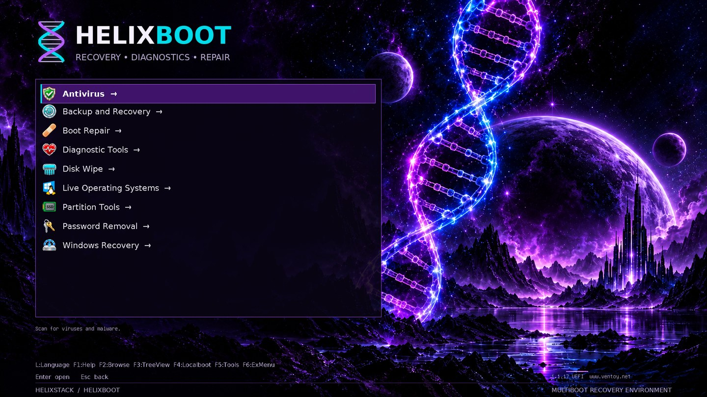
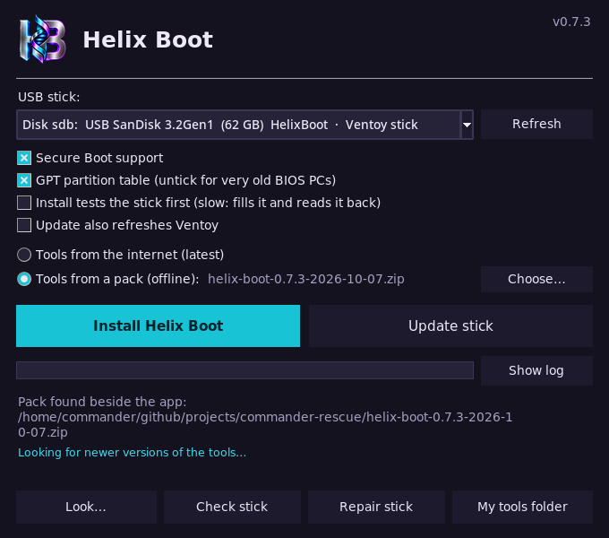
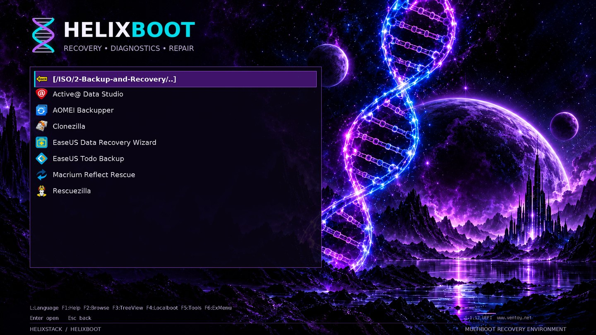
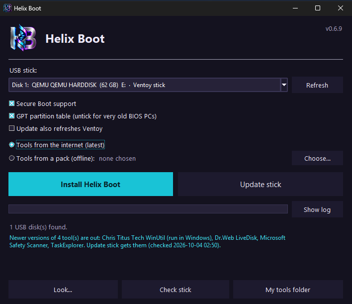
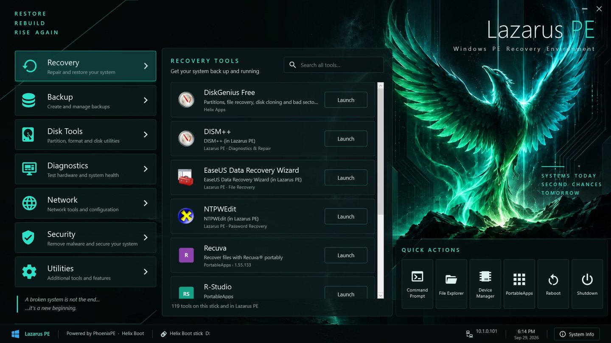
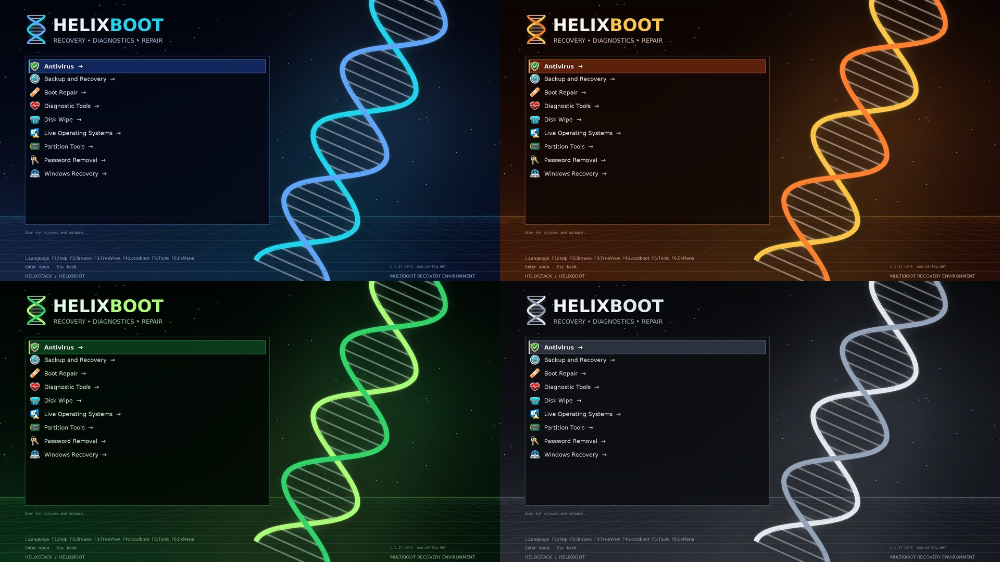

<div align="center">


# Helix Boot

**A multiboot rescue USB that builds itself from upstream sources.**<br>
Current tools, verified downloads, a MediCat-style boot menu, and room for your own licensed software.

[](https://github.com/Commanderx-code/helix-boot/actions/workflows/ci.yml)
[](https://github.com/Commanderx-code/helix-boot/actions/workflows/windows.yml)
[](https://github.com/Commanderx-code/helix-boot/releases)
[](LICENSE)


[Quick start](#quick-start) ·
[What's on the stick](#whats-on-the-stick) ·
[Packs](#packs-the-whole-stick-in-one-file) ·
[Lazarus PE](#lazarus-pe) ·
[Themes](#the-boot-menus-look) ·
[Customising](#customising) ·
[Changelog](CHANGELOG.md)



</div>

## Why

MediCat was the stick everyone carried, but its last full build dates from
December 2021: frozen versions, overlapping tools and plenty of trialware.
Helix Boot keeps the idea (one stick, a categorised menu, a Windows PE
desktop) and fixes the rest:

| | |
|---|---|
| **Always current** | Every tool resolves to its latest upstream release on each refresh. |
| **Verified** | Downloads are checked against the publisher's own checksums before they reach the stick. Anything without one is flagged, never trusted silently. |
| **Free by default** | The shipped tool list is free software and freeware. Paid tools get [bring-your-own](#bring-your-own-tools) slots for your licensed copies. |
| **Refreshable in place** | `./refresh.sh` swaps in new versions and leaves alone the files you added yourself, and the tools another PC put there. |
| **Yours to restyle** | Seven boot-menu [themes](#the-boot-menus-look), icon styles, your own background and splash: switched on a finished stick from Linux or the Windows app, with a preview first. |
| **Offline-ready** | [Packs](#packs-the-whole-stick-in-one-file) put the whole stick, your own tools included, into one zip that builds a stick with no internet, from Linux or Windows. |
| **A real recovery desktop** | [Lazarus PE](#lazarus-pe), your own Windows 11 PE, opens on a full-screen launcher with every tool on the stick sorted into categories. |
| **Nothing redistributed** | The repo holds a manifest and scripts, not binaries. The Windows PE is built from *your* Windows ISO. |

## Quick start

**Linux.** Needs Python 3.11+ and `sudo`; nothing to `pip install`.
That means Python 3.11.4 or newer: Ventoy's archive is only unpacked with the
safe extraction those versions have. Keep the stick plugged in until it's done.

```fish
git clone https://github.com/Commanderx-code/helix-boot
cd helix-boot

./helix check        # latest version of everything (no downloads)
./install.sh           # download + verify, pick a stick, type its name to confirm
```

Keep it current later:

```fish
./refresh.sh                    # update the stick in place
./refresh.sh --upgrade-ventoy   # …and the Ventoy boot loader too
./theme.sh --menu               # change how the boot menu looks
./check.sh                      # read the stick back: any damaged or missing files?
```

`./install.sh --test` tests a stick before filling it: it writes the stick
full, reads it all back and only then copies the tools on. That finds a stick
that is failing, or a fake with less room than it says, before you rely on it.
It is slow (the whole stick is written twice). An update tells you when a stick
has gone a month without a check.

**Linux, one file.** Or skip the clone: download **`HelixBoot.sh`** from
[Releases](https://github.com/Commanderx-code/helix-boot/releases), put it in a
folder of its own, then `chmod +x HelixBoot.sh && ./HelixBoot.sh`. A menu offers
Install, Update, Change a stick's look, Check for tool updates and Check a stick
for damage; `./HelixBoot.sh --help` lists the rest. Your
`local.toml` and `byo/` folder live next to it, and a pack beside it is used
with no downloads.

**Linux, in a window.** Download **`HelixBoot-linux-x86_64`** from
[Releases](https://github.com/Commanderx-code/helix-boot/releases), put it in a
folder of its own, then `chmod +x HelixBoot-linux-x86_64 && ./HelixBoot-linux-x86_64`.
It is the same window as the [Windows app](#windows-app): pick the stick, then
Install or Update, with Look, Check stick and Repair stick beside them. Run it
as your normal user. It asks for your password, in your desktop's own dialog,
only to install Ventoy and to repair a filesystem. From a clone it is
`python3 linux/helix_gui.py`, which needs Tk (`tk` on Arch, `python3-tk` on
Debian and Ubuntu).



**Windows.** Download **`HelixBoot.exe`** from
[Releases](https://github.com/Commanderx-code/helix-boot/releases), put it
in a folder of its own and run it (see [below](#windows-app)).

**Checking a download.** Every release has a `SHA256SUMS` file, and GitHub
records that the files were built from this repository by its own workflow.
To check, run `sha256sum -c SHA256SUMS` (on Windows,
`Get-FileHash HelixBoot.exe` and compare). With the GitHub CLI you can also run
`gh attestation verify HelixBoot.exe --repo Commanderx-code/helix-boot`.
Windows SmartScreen may still warn, because the `.exe` isn't code-signed yet.
The [code signing policy](docs/code-signing.md) says how signed releases are
made, and has the privacy policy: what the app contacts, and what it changes
on your PC.

**Mac.** Download **`HelixBoot-mac-arm64`** (Apple Silicon) or
**`HelixBoot-mac-x86_64`** (Intel) from
[Releases](https://github.com/Commanderx-code/helix-boot/releases). There is
nothing else to install. Put it in a folder of its own, and in Terminal:

```sh
chmod +x HelixBoot-mac-arm64
xattr -d com.apple.quarantine HelixBoot-mac-arm64   # it isn't signed by Apple, so macOS would refuse it
./HelixBoot-mac-arm64                               # update the stick that's plugged in: it asks first
```

`check` reads the stick back for damage and `look` changes its theme, as
`check.sh` and `theme.sh` do. From a clone of this repo, run the same thing as
`python3 mac/helix-mac` (Python 3.11 or newer).

Creating a stick on a Mac is **experimental**: `./HelixBoot-mac-arm64 install --disk disk4`
(add `--test` to test the stick first).
Ventoy has no installer for macOS, so this writes Ventoy's layout onto the disk
itself, as Ventoy's own installer does on Linux. CI makes a stick this way on a
Mac and boots it in a virtual PC, but it hasn't been tried on many real sticks.
If yours doesn't boot, make it once on a PC and keep it current from the Mac.

**From a stick.** Every Helix Boot stick carries both apps in its `HelixBoot`
folder, so a stick can be updated, or its look changed, from any PC: run
`HelixBoot.exe` on Windows, or `bash HelixBoot.sh` on Linux.

**From a pack.** Already have a pack zip? No clone needed:
`unzip pack.zip 'installer/*'`, then `installer/install.sh`, or on Windows run
`installer\HelixBoot.exe` from beside the zip
([details](#packs-the-whole-stick-in-one-file)).

## What's on the stick

Nine categories, each with its own icon, and every tool inside with an icon
and a one-line tip. A tenth, **OS Images**, is your own folder for installer
ISOs; it appears as soon as you put one in. Tools that only start on older BIOS PCs (DBAN, HDAT2,
SpinRite) are marked **[BIOS]**, and UEFI-only ones **[UEFI]**, detected from
each ISO's boot records. Windows `.wim` boot images (WinRE, WinPE tools) work
too: Ventoy's wimboot plugin comes with the stick.



| Menu | Tools | Source · verification |
|---|---|---|
| Antivirus | Dr.Web LiveDisk | vendor site · unverified |
| | Kaspersky Rescue Disk *(off by default, see below)* | vendor site · unverified |
| Backup and Recovery | Rescuezilla | GitHub · sha256 |
| | Clonezilla | SourceForge · sha512 |
| Boot Repair | Super GRUB2 Disk | SourceForge · sha256 |
| | Boot-Repair-Disk | SourceForge · md5 |
| Diagnostic Tools | Memtest86+ | memtest.org · sha512 |
| Disk Wipe | ShredOS (nwipe) | GitHub · sha256 |
| | DBAN (BIOS boot only) | SourceForge · md5 |
| Live Operating Systems | **Lazarus PE**, your own [PhoenixPE](https://github.com/PhoenixPE/PhoenixPE) Windows 11 build | built locally · [guide](pe/README.md) |
| | Hiren's BootCD PE | hirensbootcd.org · unverified |
| Partition Tools | GParted Live | SourceForge · sha512 |
| Password Removal | *bring your own* (e.g. Jayro's Lockpick) | [`byo/`](byo/README.md) |
| Windows Recovery | *bring your own* (Windows 10/11 setup, DaRT) | [`byo/`](byo/README.md) |
| OS Images | *yours*: drop Windows or Linux installer ISOs into `ISO/OSimages` on the stick | shown once it holds an image |

Screenshots are real Ventoy renders of a Helix Boot stick. In the menu, use
Up/Down, Enter and Esc: Ventoy's left/right keys only slide the highlighted
name sideways (built into Ventoy, not a setting).

**Portable apps** for any Windows PE, in `USB:\Apps`, listed by the Lazarus
launcher and by the Helix Apps menu (`HelixApps.cmd`, for other PEs such as Hiren's):
Sysinternals, Explorer++, Notepad++, CrystalDiskInfo, CrystalDiskMark, HWiNFO,
TestDisk & PhotoRec, ProduKey, DiskGenius Free, Microsoft Safety Scanner and
Kaspersky Virus Removal Tool *(off by default)*. The launcher also carries
[Chris Titus Tech's WinUtil](https://github.com/ChrisTitusTech/winutil) for
after a repair: run it from the stick in the fixed Windows to debloat, tweak
or reinstall apps.

**Tools for a Mac**, in `USB:/Mac` with a `README.txt`. Nothing on the stick
boots a Mac (Apple silicon can't start a PC stick at all), so these are for a
Mac that still runs, Apple silicon included: copy a tool to the Mac, then open
it. Each stays as downloaded (`.dmg`, `.pkg`, `.zip`), because an unpacked Mac
app doesn't survive the stick's exFAT file system.

| For | Tools |
|---|---|
| Finding the problem | EtreCheck, Stats, Macs Fan Control, coconutBattery, GrandPerspective |
| Malware | Malwarebytes for Mac, and from [Objective-See](https://objective-see.org): KnockKnock, TaskExplorer, LuLu, Netiquette, BlockBlock |
| Cleaning up | OnyX and Maintenance (one each for macOS 26, 15 and 14), AppCleaner, Pearcleaner |
| Data | SuperDuper! and Vorta (backup), TestDisk & PhotoRec and DMDE (recovery) |
| Reinstalling | Mist (macOS installers), OpenCore Legacy Patcher (newer macOS on older Intel Macs) |
| Handy | Keka (archives macOS can't open by itself), RustDesk (remote support), balenaEtcher (writes boot sticks) |
| Tweaks | [Chris Titus Tech's MacUtil](https://github.com/ChrisTitusTech/macutil) *(on hold upstream)* |

CI opens every one of these on a real Mac, and checks that what is inside is
whole, signed by its developer and accepted by Gatekeeper. The `README.txt`
says which macOS each one needs (AppCleaner 15.6, Keka 10.10, …); CI checks
those against the apps too.

<details>
<summary><b>Notes on unverified tools, antivirus and Kaspersky</b></summary>

*Unverified* means the publisher offers no checksum. The file is trusted on
first download and refused if it later changes without a new version (see
[verification](docs/engine.md#verification)). Antivirus tools carry their virus
definitions, so `./refresh.sh` before a job keeps them current. Microsoft
Safety Scanner stops working 10 days after download.

On newer PCs, Kaspersky Rescue Disk's *Graphic mode* can end on a black
screen when it doesn't support the graphics card: choose *Limited graphic
mode* in its menu instead (the boot-menu tip says so). Dr.Web LiveDisk runs a
2018 Linux, which may not start at all on newer PCs; Kaspersky, Malwarebytes
and the scanners in Lazarus PE cover those.

Kaspersky refuses downloads from the US, so its two tools are off. Outside the
US, turn them on in `local.toml`:

```toml
[overrides.kaspersky-rd]
enabled = true

[overrides.kvrt]
enabled = true
```

</details>

> [!TIP]
> DBAN and ShredOS overwrite **hard drives**. For SSDs and NVMe drives use
> Parted Magic's *Erase Disk*, which runs the drive's own secure erase or
> sanitize command and reaches the spare flash an overwrite can miss. The
> boot menu says so too.

Every tool is described in [`tools.toml`](tools.toml); adding one is a few lines.

### PortableApps.com

The [PortableApps.com Platform](https://portableapps.com) sits at the root of
the stick (`Start.exe`), like on MediCat: run it on any Windows PC, or from
the **PortableApps** quick action in Lazarus PE, whose launcher also lists
every app you install. Pick apps from its App Store; it keeps them and itself
up to date. Helix Boot puts the Platform
on once and never overwrites or prunes it, so your apps survive every refresh.
The Helix Apps menu also has **p) PortableApps.com menu**.

It comes with six menu themes, **Lazarus PE** (the default on a new stick)
and five **Helix** colours. The Platform's picker lists only its own themes,
so they take over the last six entries in **Options > Themes**: Modern Light
(Helix Teal), Modern Dark (Purple), Retro Light (Electric), Retro Dark (Lazarus
PE), Smooth Light (Orange) and Smooth Dark (Red). The PortableApps.com logo
the Platform would draw over a theme's corner is made transparent. Make your
own from any artwork with the menu's panels drawn in:

```fish
portableapps/make-theme.py ~/art/teal.png "Helix Teal" --slot RetroDark --accent 1ec8e6
```

It finds the panels, fits the art to the Platform's fixed 406x558 menu, and
writes the theme to `portableapps/themes/<slot>/` (`--hue` recolours the art).

### Bring your own tools

Paid and licence-restricted tools get menu slots you fill with your own copy:
Macrium Reflect, AOMEI Backupper and Partition Assistant, EaseUS Todo Backup
and Data Recovery, Paragon Hard Disk Manager, Parted Magic, Active@ Data
Studio, BootIt Bare Metal, SpinRite, PassMark MemTest86, HDAT2, Windows 10/11
Setup, Microsoft DaRT and Jayro's Lockpick. Drop the ISO into
[`byo/`](byo/README.md) under its slot name and `./refresh.sh` puts it in the
right menu. Anything else (another ISO, a `.wim`, a portable app) gets a slot
of its own in `local.toml`. Nothing in `byo/` is ever downloaded, shared or
committed.

## Packs: the whole stick in one file

Like MediCat's download, a pack is one file with every tool in it, ready to
extract onto a stick. It's made from your cache, so it includes your
bring-your-own tools and the Ventoy installer, and a new stick needs no internet:

```fish
./helix fetch                                 # bring everything up to date
./helix pack                                  # → helix-boot-<version>-<date>.zip
./install.sh --from helix-boot-<version>-<date>.zip # new stick
./refresh.sh --from helix-boot-<version>-<date>.zip # update a stick
```

The pack carries its own installer, so on another Linux PC the zip is all you need:

```fish
unzip helix-boot-<version>-<date>.zip 'installer/*'   # a few MB
installer/install.sh                               # finds the zip beside it
```

On Windows, take `installer\HelixBoot.exe` out of the zip, keep it next to the
zip and run it: the window picks the pack up on its own (**Tools from: a pack**),
and Install or Update copy everything from it, Ventoy included, with no
downloads. A pack holds both Ventoy packages (Linux and Windows) and the
latest released `HelixBoot.exe`, each checked against its published checksum.

Inside is the stick exactly as `helix sync` lays it out, with boot images
stored uncompressed and each one's sha256 recorded: the boot images, the apps,
the Mac tools, every theme preset and your own icons and splash. Extracting
streams files straight onto the stick and checks every image, so a damaged pack
is caught, not booted. A stick filled from a pack refreshes normally
afterwards, keeps the look it had, and keeps tools the pack doesn't have
([why](docs/engine.md#updating-from-more-than-one-pc)).

> [!IMPORTANT]
> A pack holds your licensed tools, so keep it private: a drive, a NAS or your
> own cloud storage, never a public repo or release. Packs made in this folder
> are git-ignored.

## Windows app



`HelixBoot.exe` asks for admin rights, because installing Ventoy writes
to the disk.

1. Pick the USB stick from the drop-down. Only USB/SD disks are listed, never
   the one Windows is running from; a stick that already has Ventoy is picked
   for you.
2. **Install** erases the stick (you type its disk number to confirm), installs
   Ventoy and copies everything on. Tick **Install tests the stick first** to
   have it written full and read back before that (slow, but it finds a failing
   or fake stick). **Update** refreshes a stick you already
   have and keeps your files, including tools this PC has no copy of. It first
   shows what it will copy, remove and keep, and asks before changing anything.
3. **Look…** changes the selected stick's look: a preset theme, the
   icons, your own background (with a slider to darken it) and splash, with a
   preview of the boot menu. Nothing changes until **Apply to the stick**.
   **Save look…** keeps the look, with your own pictures and icons, in a small
   zip. **Load look…** puts it back, or onto another stick.
4. **Check stick** reads the whole stick back and compares every boot image and
   app with what was put there, so it finds a stick that's going bad. It needs
   no downloads. The next Update copies again whatever it finds damaged. If
   files go bad again after that, it tells you to replace the stick. An update
   reminds you when a stick has gone a month without a check.
5. **Repair stick** has Windows repair the stick's filesystem (`chkdsk /f`),
   for when an update or a check says it is damaged. It asks first.

Under the title the app says whether newer versions of your tools are out. It
looks at most every 6 hours, because GitHub limits how often a PC that isn't
signed in may ask. `check_for_updates = false` under `[settings]` in
`local.toml` turns that off; the [privacy policy](docs/code-signing.md#privacy-policy)
lists everything the app contacts.

A stick is recognised whatever you have named its main partition: it is known
by Ventoy's own small `VTOYEFI` partition.

It uses the same engine as the Linux scripts: the same tool list, checksums,
theme and menu. Like the Linux scripts, Install and Update add a few lines to
Ventoy's own boot script on the stick, for the splash and for the two keys in
the menu's bottom row that open a power menu (L) and start Memtest86+ (F1).
If Windows won't let the app at Ventoy's partition, the stick starts as Ventoy
does and the row shows those keys as Ventoy has them, Language and Help. Your `local.toml` and `byo/` folder live next to the `.exe`, and
downloads are cached in `%LOCALAPPDATA%\HelixBoot`. The command line
works too: `HelixBoot.exe --help`.

**Tools from** chooses where Install and Update get the tools. *The internet*
downloads the free tools fresh; your own paid tools come along only if their
files are in the `byo` folder beside the `.exe`. *A pack* copies everything
from a pack zip with no downloads, your own tools included, and a pack next to
the `.exe` is chosen for you. From the command line, add
`--pack helix-boot-<version>-<date>.zip` to `--install` or `--update`; `--look E:\`
opens the Look window, or changes the look with `--theme`, `--icons` and so on
(`--export-look` / `--import-look` save and load one). `--check E:\` checks a
stick, and `--updates` lists the tools with newer versions.

## Lazarus PE

Lazarus PE is the stick's Windows 11 desktop, filling the role of MediCat's
Mini Windows. You build it yourself with PhoenixPE from your own Windows ISO,
because WinPE images contain Microsoft files that can't be redistributed. The
image stays lean: drivers (including Intel Wi-Fi and RST), networking and
Explorer, in its own look: the phoenix wallpaper and profile picture, dark
mode and a teal accent. The launcher, apps and startup live on the stick and
update without a rebuild. On Linux, `pe/vm/build-vm.sh` sets up the build VM
for you. See the [Lazarus PE guide](pe/README.md).

Until yours is built, Hiren's BootCD PE covers for it, and the app launcher
works there too.

### The Lazarus launcher



When Lazarus PE's desktop loads, the **Lazarus launcher** opens full screen: every
tool on the stick and in the PE, in seven categories (Recovery, Backup, Disk
Tools, Diagnostics, Network, Security, Utilities), with search across all of them
(just start typing), quick actions (Command Prompt, File Explorer, Device
Manager, PortableApps, Reboot, Shutdown) and a System Info panel that also points
out which drives hold a Windows install.

It lists your Helix Apps, every PortableApps.com app (including ones you add
from its App Store) and the PE's own Start menu, the same tool only once. It
lives on the stick in `Apps\Lazarus` (from [`pe/lazarus`](pe/lazarus)), so a
refresh updates it without a PE rebuild. Categories, sorting rules, names and
quick actions are in [`launcher.json`](pe/lazarus/launcher.json). Without it,
Lazarus PE opens the PortableApps.com menu instead.

## How it works

`install.sh`, `refresh.sh` and the Windows app are thin wrappers around `helix`,
a single standard-library Python script: `helix fetch` downloads and verifies,
`helix sync` fills a stick, `helix pack` makes an offline pack, `helix verify`
reads a stick back to find damage.

- **Verified downloads.** Each tool is checked against its publisher's own
  checksum, or GitHub's recorded digest. One with neither is refused unless
  the tool list says, in so many words, to trust it on first use.
- **Nothing touches a disk until everything is downloaded and checked.**
- **Only USB disks are offered**, never the one your system runs from, and the
  disk you confirm is checked to be the same device before each write.
- **An update keeps what it didn't bring.** Tools another PC put on the stick
  stay, with their menu entries.
- **A crafted pack or a tampered stick can't write outside the stick.**

[The engine in full](docs/engine.md): every command, how verification works,
checking a stick for damage, the safety rules, and updating from more than one PC.

## Customising

Personal changes go in `local.toml` (git-ignored), which overlays `tools.toml`:

```toml
[overrides.hirens]
enabled = false             # leave Hiren's off this stick

[[tool]]                    # add your own
name = "kali"
title = "Kali Linux"
kind = "iso"
category = "live"
source = "url"
url = "https://cdimage.kali.org/current/kali-linux-2026.3-live-amd64.iso"
version_pin = "2026.3"
checksum = [{ url = "https://cdimage.kali.org/current/SHA256SUMS" }]
```

ISOs you copy onto the stick by hand (e.g. into `ISO/Custom/`) are never touched.

### The boot menu's look

`./theme.sh` (or **Look…** in the Windows app) changes a finished stick's look
without rebuilding anything, and the choice survives a refresh: seven themes,
icon styles, your own background and splash, with a preview first.

```sh
./theme.sh --menu                           # choose from numbered lists, with a preview
./theme.sh --theme midnight                 # or ember, terminal, slate, standby, poly-dark
./theme.sh --background ~/pic.jpg --dim 40  # your own picture behind the menu
./theme.sh --export my-look.zip             # save the look; --import puts it on any stick
```



[The look in full](docs/look.md): every theme and icon style, your own icons
and splash, saving a look, and how the default theme is put together.

## Roadmap

**Next**

| Planned | |
|---|---|
| A code-signed `HelixBoot.exe` | So Windows shows a verified publisher. The [signing policy](docs/code-signing.md) is in place; the application to SignPath Foundation is next. |
| A category for legacy PCs | 32-bit and BIOS-only tools, for machines too old for the rest of the stick. |
| Icon sets per theme | The same icons redrawn in each theme's colours. |

**Shipped**

| Area | What's there | Since |
|---|---|---|
| The stick | Manifest of tools, verified downloads, installer and refresher, Ventoy menu | 0.1 |
| | Packs: the whole stick in one offline, self-installing zip | 0.3 |
| | Updates that keep another PC's tools; a renamed stick is still recognised | 0.6.2 |
| | Checking a stick for damage; Helix Boot on the stick itself | 0.6.4 – 0.6.6 |
| Boot menu | Helix Neon theme | 0.5 |
| | A splash with a loading bar | 0.6.0 |
| | Theme builder: seven themes, icon styles, your own background and splash, saved looks | 0.6.0 – 0.6.6 |
| | One icon set from the HELIXBOOT collection | 0.6.7 |
| | Hotkeys as a row of icons; a power menu on L, Memtest86+ on F1 | 0.6.8 |
| Windows app | `HelixBoot.exe`: install, update, packs, an update summary first | 0.1 – 0.6.4 |
| | The Look window, Check stick, newer-version notices | 0.6.0 – 0.6.6 |
| | A dark, compact look and the HB logo; adds the splash and menu keys like Linux | 0.6.8 – 0.6.9 |
| Linux | One-file installer (`HelixBoot.sh`) | 0.5.2 |
| | The window, as on Windows: `HelixBoot-linux-x86_64` | next |
| Lazarus PE | PhoenixPE preset and build VM, the Lazarus launcher, PortableApps.com with Helix themes | 0.1 – 0.5.1 |
| Mac | 32 tools for a working Mac, each opened and checked on a real Mac in CI | 0.6.1 – 0.6.12 |
| | Updating a stick from a Mac; creating one (experimental) | 0.6.14 |
| | One-file download for Apple Silicon Macs | 0.7.0 |
| | One-file download for Intel Macs | 0.7.2 |
| Stick health | A repair command for a damaged filesystem; a memory of damage | 0.7.1 |
| | Testing a stick before installing; check reminders; Repair stick in the Windows app | 0.7.2 |
| Trust | CI: tests, a boot test of every theme, a weekly live download and verify of every tool | 0.1 – 0.6.4 |
| | Checksums and build attestations on every release | 0.6.6 |
| | Hardening: the confirmed disk is the one written, plain file trees only, pinned download sites | 0.6.11 – 0.6.13 |

The [changelog](CHANGELOG.md) has every release in detail.

## Contributing

Bug reports, tool suggestions and pull requests are welcome. See
[CONTRIBUTING.md](CONTRIBUTING.md), and please report security issues
privately as described in [SECURITY.md](SECURITY.md).

## Credits and license

Built on [Ventoy](https://www.ventoy.net),
[PhoenixPE](https://github.com/PhoenixPE/PhoenixPE) and the
[PortableApps.com Platform](https://portableapps.com), with thanks to every tool
author listed in [`tools.toml`](tools.toml). The plain fallback category
icons are from [Material Design Icons](https://pictogrammers.com/library/mdi/).
Inspired by MediCat USB.

This repo's scripts are [MIT](LICENSE) licensed. Each tool keeps its own
license, and nothing here grants rights to software you bring yourself. Product
names, logos and icons belong to their owners and only identify the software
([icon notes](docs/tool-icons.md)). Two of
the boot-menu themes are other people's work under their own licences, credited
in their folders: [Standby](theme/presets/standby/NOTICE.md) (GPL) and
[Poly dark](theme/presets/poly-dark/NOTICE.md) (MIT).
