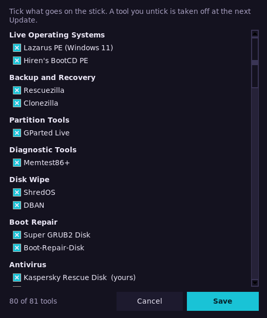

# Installing and updating

Every way to make a Helix Boot stick and keep it current: the Linux scripts, the one-file
downloads for Linux, Windows and Mac, and the window on Windows and Linux.

## The ways in

**Linux.** Needs Python 3.11+ and `sudo`; nothing to `pip install`.
That means Python 3.11.4 or newer: Ventoy's archive is only unpacked with the
safe extraction those versions have. Keep the stick plugged in until it's done.

```fish
git clone https://github.com/Commanderx-code/helix-boot
cd helix-boot

./helix check        # latest version of everything (no downloads)
./install.sh           # download + verify, pick a stick, type its name to confirm
```

Keep it current later:

```fish
./refresh.sh                    # update the stick in place
./refresh.sh --upgrade-ventoy   # …and the Ventoy boot loader too
./theme.sh --menu               # change how the boot menu looks
./check.sh                      # read the stick back: any damaged or missing files?
```

`./install.sh --test` tests a stick before filling it: it writes the stick
full, reads it all back and only then copies the tools on. That finds a stick
that is failing, or a fake with less room than it says, before you rely on it.
It is slow (the whole stick is written twice). An update tells you when a stick
has gone a month without a check.

**Linux, one file.** Or skip the clone: download **`HelixBoot.sh`** from
[Releases](https://github.com/Commanderx-code/helix-boot/releases), put it in a
folder of its own, then `chmod +x HelixBoot.sh && ./HelixBoot.sh`. A menu offers
Install, Update, Change a stick's look, Check for tool updates and Check a stick
for damage; `./HelixBoot.sh --help` lists the rest. Your
`local.toml` and `byo/` folder live next to it, and a pack beside it is used
with no downloads.

**Linux, in a window.** Download **`HelixBoot-linux-x86_64`** from
[Releases](https://github.com/Commanderx-code/helix-boot/releases), put it in a
folder of its own, then `chmod +x HelixBoot-linux-x86_64 && ./HelixBoot-linux-x86_64`.
It is the same window as the [Windows app](install.md#the-windows-app): pick the stick, then
Install or Update, with Look, Check stick and Repair stick beside them. Run it
as your normal user. It asks for your password, in your desktop's own dialog,
only to install Ventoy and to repair a filesystem. From a clone it is
`python3 linux/helix_gui.py`, which needs Tk (`tk` on Arch, `python3-tk` on
Debian and Ubuntu). `./HelixBoot-linux-x86_64 --add-launcher` puts it in your
applications menu.


**Windows.** Download **`HelixBoot.exe`** from
[Releases](https://github.com/Commanderx-code/helix-boot/releases), put it
in a folder of its own and run it (see [below](install.md#the-windows-app)).

<a id="checking-a-download"></a>**Checking a download.** Every release has a `SHA256SUMS` file, and GitHub
records that the files were built from this repository by its own workflow.
To check, run `sha256sum -c SHA256SUMS` (on Windows,
`Get-FileHash HelixBoot.exe` and compare). With the GitHub CLI you can also run
`gh attestation verify HelixBoot.exe --repo Commanderx-code/helix-boot`.
Windows SmartScreen may still warn, because the `.exe` isn't code-signed yet.
The [code signing policy](code-signing.md) says how signed releases are
made, and has the privacy policy: what the app contacts, and what it changes
on your PC.

**Mac.** Download **`HelixBoot-mac-arm64`** (Apple Silicon) or
**`HelixBoot-mac-x86_64`** (Intel) from
[Releases](https://github.com/Commanderx-code/helix-boot/releases). There is
nothing else to install. Put it in a folder of its own, and in Terminal:

```sh
chmod +x HelixBoot-mac-arm64
xattr -d com.apple.quarantine HelixBoot-mac-arm64   # it isn't signed by Apple, so macOS would refuse it
./HelixBoot-mac-arm64                               # update the stick that's plugged in: it asks first
```

`check` reads the stick back for damage and `look` changes its theme, as
`check.sh` and `theme.sh` do. From a clone of this repo, run the same thing as
`python3 mac/helix-mac` (Python 3.11 or newer).

Creating a stick on a Mac is **experimental**: `./HelixBoot-mac-arm64 install --disk disk4`
(add `--test` to test the stick first).
Ventoy has no installer for macOS, so this writes Ventoy's layout onto the disk
itself, as Ventoy's own installer does on Linux. CI makes a stick this way on a
Mac and boots it in a virtual PC, but it hasn't been tried on many real sticks.
If yours doesn't boot, make it once on a PC and keep it current from the Mac.

**From a stick.** Every Helix Boot stick carries both apps in its `HelixBoot`
folder, so a stick can be updated, or its look changed, from any PC: run
`HelixBoot.exe` on Windows, or `bash HelixBoot.sh` on Linux.

**From a pack.** Already have a pack zip? No clone needed:
`unzip pack.zip 'installer/*'`, then `installer/install.sh`, or on Windows run
`installer\HelixBoot.exe` from beside the zip
([details](packs.md)).

## The Windows app

The same window runs on Linux (`HelixBoot-linux-x86_64`), where a stick is a mount point and
not a drive letter and Repair stick runs `fsck`.


`HelixBoot.exe` asks for admin rights, because installing Ventoy writes
to the disk.

1. Pick the USB stick from the drop-down. Only USB/SD disks are listed, never
   the one Windows is running from; a stick that already has Ventoy is picked
   for you.
2. **Install** erases the stick (you type its disk number to confirm), installs
   Ventoy and copies everything on. Tick **Install tests the stick first** to
   have it written full and read back before that (slow, but it finds a failing
   or fake stick). **Update** refreshes a stick you already
   have and keeps your files, including tools this PC has no copy of. It first
   shows what it will copy, remove and keep, and asks before changing anything.
3. **Look…** changes the selected stick's look: a preset theme, the
   icons, your own background (with a slider to darken it) and splash, with a
   preview of the boot menu. Nothing changes until **Apply to the stick**.
   **Save look…** keeps the look, with your own pictures and icons, in a small
   zip. **Load look…** puts it back, or onto another stick.
4. **Check stick** reads the whole stick back and compares every boot image and
   app with what was put there, so it finds a stick that's going bad. It needs
   no downloads. The next Update copies again whatever it finds damaged. If
   files go bad again after that, it tells you to replace the stick. An update
   reminds you when a stick has gone a month without a check.
5. **Repair stick** has Windows repair the stick's filesystem (`chkdsk /f`),
   for when an update or a check says it is damaged. It asks first.
6. **Tools…** is a list of every tool to tick, by category: what goes on the
   stick, without editing `local.toml`. It applies from the next Update.
7. **Eject**, beside Refresh, flushes what was written and ejects the stick, so
   it is safe to unplug.



Check stick also watches the programs you add to the stick yourself, portable
apps for one. It remembers what each was and tells you when one has changed
since the last check: expected if you updated it, a warning if you didn't.

Some antivirus programs stop a few tools being written. ProduKey is one, which
is why it is off unless you tick it in **Tools…**. With such a tool ticked, the
app says so before an install and offers to leave it out; otherwise it is
tried, skipped if blocked, and named at the end.

The app keeps itself current too. When it starts it looks for a newer Helix
Boot and asks whether to get it, and **Check for update** under the version
number does that whenever you click it. The new program is downloaded from the
release, checked against the checksum GitHub records for it, and takes the
place of the one that is running; close the window and start it again.

Under the title the app says whether newer versions of your tools are out. It
looks at most every 6 hours, because GitHub limits how often a PC that isn't
signed in may ask. `check_for_updates = false` under `[settings]` in
`local.toml` turns that off; the [privacy policy](code-signing.md#privacy-policy)
lists everything the app contacts.

A stick is recognised whatever you have named its main partition: it is known
by Ventoy's own small `VTOYEFI` partition.

It uses the same engine as the Linux scripts: the same tool list, checksums,
theme and menu. Like the Linux scripts, Install and Update add a few lines to
Ventoy's own boot script on the stick, for the splash and for the two keys in
the menu's bottom row that open a power menu (L) and start Memtest86+ (F1).
If Windows won't let the app at Ventoy's partition, the stick starts as Ventoy
does and the row shows those keys as Ventoy has them, Language and Help. Your `local.toml` and `byo/` folder live next to the `.exe`, and
downloads are cached in `%LOCALAPPDATA%\HelixBoot`. The command line
works too: `HelixBoot.exe --help`.

**Tools from** chooses where Install and Update get the tools. *The internet*
downloads the free tools fresh; your own paid tools come along only if their
files are in the `byo` folder beside the `.exe`. *A pack* copies everything
from a pack zip with no downloads, your own tools included, and a pack next to
the `.exe` is chosen for you. From the command line, add
`--pack helix-boot-<version>-<date>.zip` to `--install` or `--update`; `--look E:\`
opens the Look window, or changes the look with `--theme`, `--icons` and so on
(`--export-look` / `--import-look` save and load one). `--check E:\` checks a
stick, and `--updates` lists the tools with newer versions.
