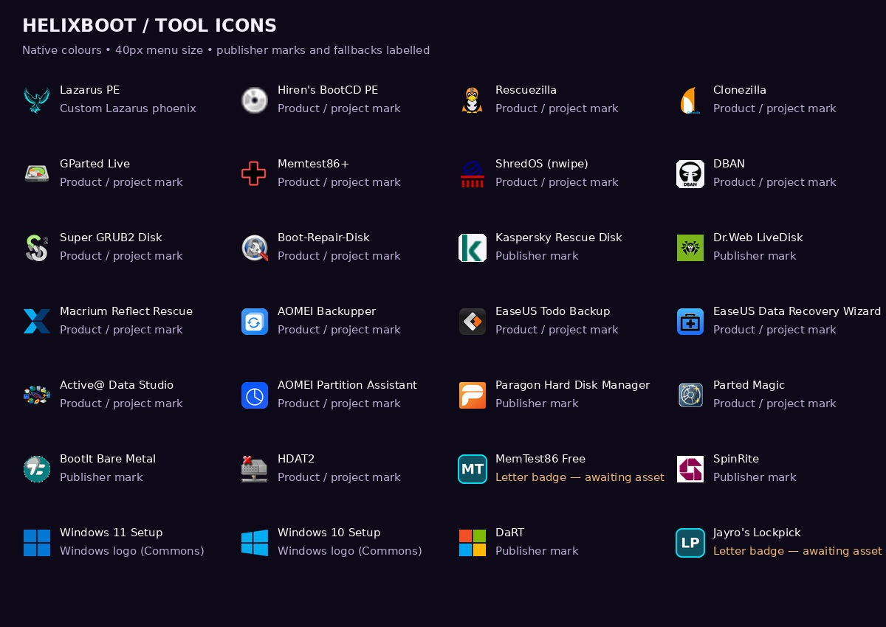

# Boot-tool icons

26 of the 28 boot entries now use artwork instead of letter badges: 17
product/project marks, six publisher marks, two Windows logos reproduced on
Wikimedia Commons, and one custom Lazarus PE phoenix. **PassMark MemTest86 Free
and Jayro’s Lockpick still use their letter badges.** Memtest86+ is a separate
project and has its own verified icon.

MemTest86's asset downloads returned HTTP 403 in the build environment, and
no verified standalone Lockpick artwork was obtained. No lookalike logo was
invented for either. A logo on a publisher's website is not automatically a
product icon; publisher marks below are explicitly identified.

## Apply and rebuild

Apply the icon patch after the purple DNA theme patch, then run `./refresh.sh`.
All rendered `theme/icons/*.png` are committed, so users do not need image
libraries, upstream access or a font rebuild to use them. These are Ventoy
boot-menu icons; PortableApps continues to use the icons shipped by each app.

`python3 theme/build-theme.py --skip-fonts` rebuilds the graphics from the
curated PNG masters in `docs/artwork/tool-icons/`. Masters are at most 256px;
the builder preserves aspect ratio and original colours, fits each into a
36px area within a transparent 40px canvas, and centres it. Dark DBAN and
Kaspersky marks get a light backplate so their original colours remain legible.
Opaque backgrounds supplied by publishers are preserved. A missing registered
master raises an error rather than quietly replacing it with initials.

Your existing `byo/icons/<tool-name>.png` overrides still win during refresh.
Use `byo/icons/memtest86.png` or `byo/icons/lockpick.png` when you have verified
art from your own media. Those files are never changed by the theme builder.

## Sources and rights

Sources were retrieved on 2026-09-29. `artwork/tool-icons/sources.json` records
original URLs, source-byte and normalized-master SHA-256 hashes, and notes.
The Windows vectors are Commons reproductions of Microsoft logos (marked
PD-textlogo there), not files downloaded directly from Microsoft. Macrium's
icon is the current Reflect X brandmark from its official media kit; older
versions may have different icons. Hiren's and a few older tools provide only
small icons, so those naturally look less sharp than vector-derived artwork.

Third-party artwork and marks belong to their respective owners and are not
relicensed under HELIXBOOT's code license. They identify the corresponding
software; inclusion does not imply publisher endorsement or blanket permission
to reuse the artwork elsewhere. Upstream terms remain applicable. Source URLs
are provenance records, not a claim that every publisher granted redistribution
permission.

The Lazarus phoenix is custom artwork derived with the built-in image tool
from the existing user-approved `portableapps/themes/RetroDark/chrome.png`.
Prompt: isolate the cyan/green phoenix; retain raised wings, right-facing head,
feather details and recognizable silhouette; remove all text, panels and
landscape; place it on transparency for a small boot-menu icon. It is not
third-party official artwork.

| Boot entry | Artwork type | Source |
|---|---|---|
| Lazarus PE (Windows 11) | Custom phoenix | Existing Lazarus theme |
| Hiren's BootCD PE | Product / project mark | [Source](https://www.hirensbootcd.org/favicon.ico) |
| Rescuezilla | Product / project mark | [Source](https://raw.githubusercontent.com/rescuezilla/rescuezilla/57277477b9179ae8a8f894815a69340469157f7e/src/apps/rescuezilla/rescuezilla/usr/share/pixmaps/rescuezilla.svg) |
| Clonezilla | Product / project mark | [Source](https://clonezilla.org/images/clonezilla_logo_transparent.gif) |
| GParted Live | Product / project mark | [Source](https://gparted.org/images/gparted-64x42.png) |
| Memtest86+ | Product / project mark | [Source](https://www.memtest.org/assets/media/logos/favicon.ico) |
| ShredOS (nwipe) | Product / project mark | [Source](https://raw.githubusercontent.com/PartialVolume/shredos.x86_64/f083d8432cb002388bd58871cc00a94616a174f6/board/shredos/shredos.ico) |
| DBAN | Product / project mark | [Source](https://a.fsdn.com/allura/p/dban/icon) |
| Super GRUB2 Disk | Product / project mark | [Source](https://www.supergrubdisk.org/wp-content/themes/SGD/images/S2.png) |
| Boot-Repair-Disk | Product / project mark | [Source](https://a.fsdn.com/allura/p/boot-repair-cd/icon) |
| Kaspersky Rescue Disk | Publisher mark | [Source](https://support.kaspersky.com/assets/images/favicon_.png) |
| Dr.Web LiveDisk | Publisher mark | [Source](https://st.drweb.com/static/new-www/favicons/apple-touch-icon-180x180.png) |
| Macrium Reflect Rescue | Product / project mark | [Source](https://www.macrium.com/media-pack) |
| AOMEI Backupper | Product / project mark | [Source](https://www.aomeitech.com/resources/images/logo/ab.svg) |
| EaseUS Todo Backup | Product / project mark | [Source](https://www.easeus.com/images_2019/product/all_icon/todobackup.svg) |
| EaseUS Data Recovery Wizard | Product / project mark | [Source](https://www.easeus.com/images_2019/product/all_icon/pcdatarecovery.svg) |
| Active@ Data Studio | Product / project mark | [Source](https://www.lsoft.net/images/icons/data-studio.png) |
| AOMEI Partition Assistant | Product / project mark | [Source](https://www.aomeitech.com/resources/images/logo/dp-pa-ic-40-free.svg) |
| Paragon Hard Disk Manager | Publisher mark | [Source](https://www.paragon-software.com/wp-content/themes/paragon_3_test/icons/apple-touch-icon.png?v=wAOgWo8MMY) |
| Parted Magic | Product / project mark | [Source](https://partedmagic.com/wp-content/uploads/2018/03/pmagic225.png) |
| BootIt Bare Metal | Publisher mark | [Source](https://www.terabyteunlimited.com/favicon.ico) |
| HDAT2 | Product / project mark | [Source](https://www.hdat2.com/favicon.ico) |
| PassMark MemTest86 Free | Letter badge retained | No verified usable icon obtained; existing letter badge retained. Supply byo/icons/memtest86.png to override. |
| SpinRite | Publisher mark | [Source](https://www.grc.com/apple-touch-icon.png) |
| Windows 11 Setup | Windows logo reproduction | [Source](https://commons.wikimedia.org/wiki/Special:FilePath/Windows_logo_-_2021.svg) |
| Windows 10 Setup | Windows logo reproduction | [Source](https://commons.wikimedia.org/wiki/Special:FilePath/Windows_logo_-_2012.svg) |
| Microsoft DaRT | Publisher mark | [Source](https://support.microsoft.com/apple-touch-icon.png) |
| Jayro's Lockpick | Letter badge retained | No verified usable icon obtained; existing letter badge retained. Supply byo/icons/lockpick.png to override. |
