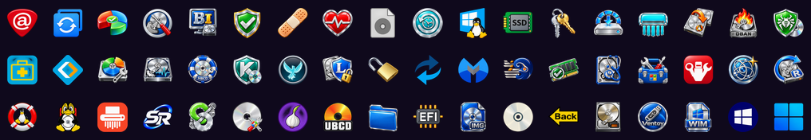

# Boot-menu icons

## The default set

Every boot tool, category and Ventoy entry (folder, "back", ISO, WIM, …) has an
icon from one glossy set, the HELIXBOOT icon collection, supplied by the
project's maintainer. They are the same on every theme; Standby and Poly dark
show them in shades of grey.

Their masters are in `artwork/helix-icons/`, one 128-pixel PNG per menu class:
a tool's `name`, `cat-<category id>`, or one of Ventoy's own classes.
`theme/build-theme.py` trims each, keeps its proportions and centres it on the
40-pixel icon the boot loader shows (bigger icons use up its memory at boot).
Every shipped tool has one. Lazarus PE's is drawn by
`artwork/helix-icons/make-lazarus-pe.py`: the project's own phoenix on a glass
globe in a steel ring, to sit with the rest. A tool with no master gets a
letter badge. A few masters are for tools people commonly add themselves (`r-studio`, `ubcd`, `tails`, …), so those get an
icon as soon as a tool by that name exists. To change one, replace its master
and re-run the builder; to add your own without touching the repo, use
`byo/icons/`.

These icons are illustrations, not the publishers' official artwork. Product
names and marks belong to their respective owners and are used only to
identify the software; inclusion does not imply endorsement.

## More icons

`artwork/helix-icons/more/` holds the rest of the collection at the same size:
icons for tools that aren't on the stick as shipped (Acronis, DiskGenius,
Arch Linux, …) and a few spare variants. They aren't built into the theme. To
use one, copy it into `artwork/helix-icons/` under the tool's `name` and re-run
the builder, or copy it to `byo/icons/<tool-name>.png`.

## Apply and rebuild

Run `./refresh.sh`. The rendered icons (`theme/icons/*.png`) are committed, so
users do not need image libraries to use them. These are Ventoy boot-menu
icons; PortableApps continues to use the icons shipped by each app.

`python3 theme/build-theme.py --skip-fonts` rebuilds the set from its masters.
The builder preserves each master's proportions and colours and centres it on
a transparent 40px canvas.

Your existing `byo/icons/<tool-name>.png` overrides still win during refresh.
Those files are never changed by the theme builder.

The `badges` icon pack (`./theme.sh --icons badges`) shows two-letter badges
in place of the icons. Until 0.6.6 there was also a `classic` pack, with each
tool's own logo; it was removed when the collection became the one set.
